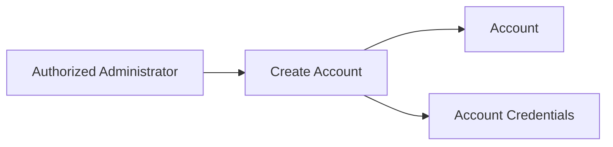
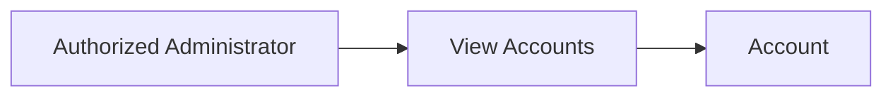
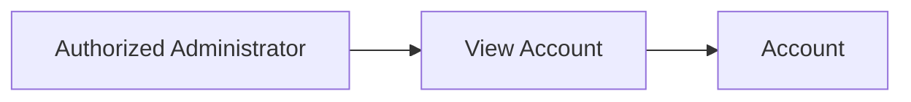
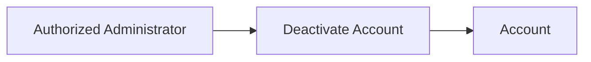
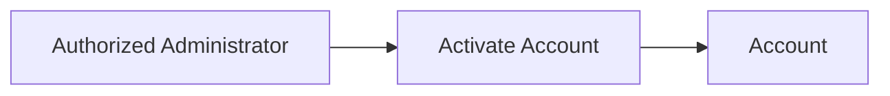
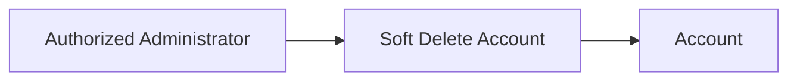
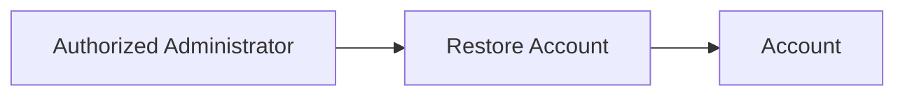

# Account Domain Ready For Implement Design

## Table of Contents

1. [Requirements](#1-requirements)

   * [1.1 Account](#11-account)
   * [1.2 Account Credentials](#12-account-credentials)
   * [1.3 Account Lifecycle](#13-account-lifecycle)
   * [1.4 Non-Functional Requirements](#14-non-functional-requirements)

2. [Security](#2-security)

   * [2.1 Security Requirements](#21-security-requirements)

     * [2.1.1 Functional Requirements](#211-functional-requirements)
     * [2.1.2 Non-Functional Requirements](#212-non-functional-requirements)
   * [2.2 Security Decisions](#22-security-decisions)

     * [2.2.1 Email](#221-email)
     * [2.2.2 Password](#222-password)
     * [2.2.3 Admin API Authentication](#223-admin-api-authentication)

3. [Design Decisions](#3-design-decisions)

   * [3.1 Account](#31-account)
   * [3.2 Account Credentials](#32-account-credentials)
   * [3.3 Account Lifecycle](#33-account-lifecycle)

4. [Data Model](#4-data-model)

   * [4.1 `account`](#41-account)
   * [4.2 `account_credentials`](#42-account_credentials)

5. [Use Cases](#5-use-cases)

   * [5.1 Create Account](#51-create-account)
   * [5.2 View Accounts](#52-view-accounts)
   * [5.3 View Account](#53-view-account)
   * [5.4 Update Account](#54-update-account)
   * [5.5 Deactivate Account](#55-deactivate-account)
   * [5.6 Activate Account](#56-activate-account)
   * [5.7 Soft Delete Account](#57-soft-delete-account)
   * [5.8 Restore Account](#58-restore-account)
   * [5.9 Hard Delete Account](#59-hard-delete-account)
   * [5.10 Change Email](#510-change-email)
   * [5.11 Change Password](#511-change-password)

6. [API Contract](#6-api-contract)

   * [6.1 API Rules](#61-api-rules)
   * [6.2 Account Endpoints](#62-account-endpoints)
   * [6.3 Create Account](#63-create-account)
   * [6.4 View Accounts](#64-view-accounts)
   * [6.5 View Account](#65-view-account)
   * [6.6 Update Account](#66-update-account)
   * [6.7 Deactivate Account](#67-deactivate-account)
   * [6.8 Activate Account](#68-activate-account)
   * [6.9 Soft Delete Account](#69-soft-delete-account)
   * [6.10 Restore Account](#610-restore-account)
   * [6.11 Hard Delete Account](#611-hard-delete-account)
   * [6.12 Change Email](#612-change-email)
   * [6.13 Change Password](#613-change-password)
   * [6.14 Account Response](#614-account-response)
   * [6.15 Error Response](#615-error-response)
   * [6.16 HTTP Status Codes](#616-http-status-codes)

7. [Implementation Status](#7-implementation-status)

   * [7.1 Requirements](#71-requirements)
   * [7.2 Security](#72-security)
   * [7.3 Design Decisions](#73-design-decisions)
   * [7.4 Data Model](#74-data-model)
   * [7.5 Use Cases](#75-use-cases)
   * [7.6 API Contract](#76-api-contract)

---

# 1. Requirements

## 1.1 Account

| ID             | Requirement                                                                                         |
| -------------- | --------------------------------------------------------------------------------------------------- |
| `AC_REQ_FC_01` | The system must create an account.                                                                  |
| `AC_REQ_FC_02` | The system must assign a unique identifier to each account.                                         |
| `AC_REQ_FC_03` | The system must record the account creation timestamp.                                              |
| `AC_REQ_FC_04` | The system must record the latest Account entity update timestamp.                                  |
| `AC_REQ_FC_05` | The system must support `active` and `inactive` statuses.                                           |
| `AC_REQ_FC_06` | The system must allow Account fields to be updated.                                                 |
| `AC_REQ_FC_07` | The system must record the account responsible for creating or updating an account when applicable. |

## 1.2 Account Credentials

| ID             | Requirement                                                         |
| -------------- | ------------------------------------------------------------------- |
| `AC_REQ_FC_08` | Each account must have exactly one credential set.                  |
| `AC_REQ_FC_09` | The current authentication method must be email and password.       |
| `AC_REQ_FC_10` | The system must use email as the authentication identifier.         |
| `AC_REQ_FC_11` | The system must enforce unique email identity.                      |
| `AC_REQ_FC_12` | The system must allow email and password credentials to be updated. |

## 1.3 Account Lifecycle

| ID             | Requirement                                                                       |
| -------------- | --------------------------------------------------------------------------------- |
| `AC_REQ_FC_13` | The system must support soft deletion of an account.                              |
| `AC_REQ_FC_14` | The system must record the soft-deletion timestamp.                               |
| `AC_REQ_FC_15` | The system must record the account responsible for soft deletion when applicable. |
| `AC_REQ_FC_16` | The system must prevent authentication for inactive accounts.                     |
| `AC_REQ_FC_17` | The system must prevent authentication for soft-deleted accounts.                 |
| `AC_REQ_FC_18` | The system must prevent deactivation of the last active administrator account.    |
| `AC_REQ_FC_19` | The system must support explicit hard deletion when permitted.                    |
| `AC_REQ_FC_20` | The system must support restoration of a soft-deleted account.                    |

## 1.4 Non-Functional Requirements

| ID                 | Requirement                                                            |
| ------------------ | ---------------------------------------------------------------------- |
| `AC_REQ_NON_FC_01` | Account lifecycle operations must preserve defined Account invariants. |
| `AC_REQ_NON_FC_02` | Account timestamps must use `TIMESTAMPTZ`.                             |
| `AC_REQ_NON_FC_03` | Account lifecycle data must remain separate from credential data.      |
| `AC_REQ_NON_FC_04` | Soft-deleted accounts must be excluded from normal Account operations. |
| `AC_REQ_NON_FC_05` | Hard deletion must be an explicit operation.                           |

---

# 2. Security

## 2.1 Security Requirements

### 2.1.1 Functional Requirements

| ID                 | Requirement                                                                    |
| ------------------ | ------------------------------------------------------------------------------ |
| `AC_SEC_REQ_FC_01` | The system must authenticate using email and password.                         |
| `AC_SEC_REQ_FC_02` | The system must verify the supplied password against the stored password hash. |
| `AC_SEC_REQ_FC_03` | The system must allow an email address to be changed.                          |
| `AC_SEC_REQ_FC_04` | The system must allow a password to be changed.                                |

### 2.1.2 Non-Functional Requirements

| ID                     | Requirement                                                                                             |
| ---------------------- | ------------------------------------------------------------------------------------------------------- |
| `AC_SEC_REQ_NON_FC_01` | Passwords must never be stored in plaintext.                                                            |
| `AC_SEC_REQ_NON_FC_02` | Passwords must be hashed using Argon2id.                                                                |
| `AC_SEC_REQ_NON_FC_03` | Each password must use a unique salt.                                                                   |
| `AC_SEC_REQ_NON_FC_04` | Passwords must have a minimum length of 15 characters.                                                  |
| `AC_SEC_REQ_NON_FC_05` | The system must support passwords of at least 64 characters.                                            |
| `AC_SEC_REQ_NON_FC_06` | The password policy must not require arbitrary character composition rules.                             |
| `AC_SEC_REQ_NON_FC_07` | The system must reject commonly used or compromised passwords.                                          |
| `AC_SEC_REQ_NON_FC_08` | Authentication credentials must not be exposed through normal responses, logs, or administrative views. |

## 2.2 Security Decisions

### 2.2.1 Email

| ID                    | Decision                        | Definition |
| --------------------- | ------------------------------- | ---------- |
| `AC_SEC_DEC_EMAIL_01` | Email identity                  | Email identity is case-insensitive. |
| `AC_SEC_DEC_EMAIL_02` | Email storage                   | `email` stores the canonical application email value. |
| `AC_SEC_DEC_EMAIL_03` | Email normalization             | Trim surrounding whitespace and normalize the domain using IDNA2008. |
| `AC_SEC_DEC_EMAIL_04` | Local-part handling             | Preserve local-part case in the stored `email` value. |
| `AC_SEC_DEC_EMAIL_05` | Provider-specific normalization | Do not remove `+` tags or modify provider-specific dot conventions. |
| `AC_SEC_DEC_EMAIL_06` | Email uniqueness                | Enforce case-insensitive uniqueness using `email_normalized`. |
| `AC_SEC_DEC_EMAIL_07` | Email syntax                    | Accept only a valid modern email `addr-spec`. Reject display names, comments, obsolete syntax, and domain literals. Use a standards-compliant email parser. |
| `AC_SEC_DEC_EMAIL_08` | Email length                    | The complete email address must not exceed 254 characters. |
| `AC_SEC_DEC_EMAIL_09` | Unicode and IDN                 | Support Unicode local-parts and IDN domains. Normalize the domain using IDNA2008 before generating `email_normalized`. |
| `AC_SEC_DEC_EMAIL_10` | Comparison key | Generate `email_normalized` as `NFD(toCasefold(NFD(local-part))) + "@" + IDNA2008-normalized ASCII domain`. Use `email_normalized` as the unique case-insensitive identity key. |

### 2.2.2 Password

| ID                       | Decision              | Definition |
| ------------------------ | --------------------- | ---------- |
| `AC_SEC_DEC_PASSWORD_01` | Password storage      | Store only the password hash. |
| `AC_SEC_DEC_PASSWORD_02` | Hashing               | Use Argon2id. |
| `AC_SEC_DEC_PASSWORD_03` | Salt                  | Use a unique salt for every password. |
| `AC_SEC_DEC_PASSWORD_04` | Minimum length        | Passwords must contain at least 15 characters. |
| `AC_SEC_DEC_PASSWORD_05` | Maximum length        | Support passwords of at least 64 characters. |
| `AC_SEC_DEC_PASSWORD_06` | Composition            | Do not require uppercase, lowercase, number, or symbol combinations. |
| `AC_SEC_DEC_PASSWORD_07` | Blocklist              | Reject passwords found in the configured common, expected, or compromised password blocklist. |
| `AC_SEC_DEC_PASSWORD_08` | Plaintext              | Never persist plaintext passwords. |
| `AC_SEC_DEC_PASSWORD_09` | Blocklist source       | Use Have I Been Pwned Pwned Passwords as the compromised-password source and maintain a project-specific common/context-specific password list. |
| `AC_SEC_DEC_PASSWORD_10` | Blocklist update       | Maintain the blocklist locally with a version and controlled refresh process. |
| `AC_SEC_DEC_PASSWORD_11` | Blocklist comparison   | Compare the complete prospective password against the blocklist. Do not compare substrings. |
| `AC_SEC_DEC_PASSWORD_12` | Blocklist failure      | Continue using the last known good local blocklist when a refresh fails. Do not bypass blocklist enforcement because a refresh is unavailable. |

### 2.2.3 Admin API Authentication

| ID                   | Decision                     | Definition                                                                                                                                                                                                                                      |
| -------------------- | ---------------------------- | ----------------------------------------------------------------------------------------------------------------------------------------------------------------------------------------------------------------------------------------------- |
| `AC_SEC_DEC_AUTH_01` | Authentication scheme        | The Admin API uses the HTTP `Bearer` authentication scheme defined by RFC 6750.                                                                                                                                                                 |
| `AC_SEC_DEC_AUTH_02` | Request credentials          | Authenticated Admin API requests must provide credentials in the HTTP `Authorization` header using the `Bearer` scheme.                                                                                                                         |
| `AC_SEC_DEC_AUTH_03` | Authorization header format  | `Authorization: Bearer <token>`                                                                                                                                                                                                                 |
| `AC_SEC_DEC_AUTH_04` | Credential location          | Bearer credentials must not be provided in URI query parameters or request bodies.                                                                                                                                                              |
| `AC_SEC_DEC_AUTH_05` | Protection realm             | The Admin API protection realm is `admin-api`.                                                                                                                                                                                                  |
| `AC_SEC_DEC_AUTH_06` | Missing authentication       | A request without authentication credentials must return `401 Unauthorized` with `WWW-Authenticate: Bearer realm="admin-api"`.                                                                                                                  |
| `AC_SEC_DEC_AUTH_07` | Invalid authentication       | A request with an invalid, expired, revoked, or otherwise unusable bearer token must return `401 Unauthorized` with `WWW-Authenticate: Bearer realm="admin-api", error="invalid_token"`.                                                        |
| `AC_SEC_DEC_AUTH_08` | Missing-credential challenge | A missing-credential `WWW-Authenticate` challenge must not include a Bearer `error` parameter.                                                                                                                                                  |
| `AC_SEC_DEC_AUTH_09` | Credential confidentiality   | Bearer credentials must never be returned in API responses or written to application logs.                                                                                                                                                      |
| `AC_SEC_DEC_AUTH_10` | Transport security           | Bearer credentials must only be transmitted over HTTPS/TLS.                                                                                                                                                                                     |
| `AC_SEC_DEC_AUTH_11` | Unsupported authentication   | The Admin API does not accept Basic authentication, API-key authentication, query-parameter tokens, or body-parameter tokens.                                                                                                                   |
| `AC_SEC_DEC_AUTH_12` | Authentication scope         | Email and password authenticate the account. Bearer credentials authenticate subsequent Admin API requests. Bearer token issuance, validation, storage, expiration, refresh, rotation, and revocation are defined by the Authentication domain. |

---

# 3. Design Decisions

## 3.1 Account

| ID                  | Decision               | Definition |
| ------------------- | ---------------------- | ---------- |
| `AC_DEC_ACCOUNT_01` | Identifier             | `account.id` uses PostgreSQL `uuid`. |
| `AC_DEC_ACCOUNT_02` | ID generation          | Generate IDs with PostgreSQL native `uuidv7()`. |
| `AC_DEC_ACCOUNT_03` | Creation timestamp     | `created_at TIMESTAMPTZ NOT NULL`. |
| `AC_DEC_ACCOUNT_04` | Update timestamp       | `updated_at TIMESTAMPTZ NOT NULL`. |
| `AC_DEC_ACCOUNT_05` | Deletion timestamp     | `deleted_at TIMESTAMPTZ NULL`. |
| `AC_DEC_ACCOUNT_06` | Time zone              | Store timestamps in UTC. |
| `AC_DEC_ACCOUNT_07` | Status                 | Only `active` and `inactive`. |
| `AC_DEC_ACCOUNT_08` | `created_by`           | Nullable FK to `account.id`, `ON DELETE SET NULL`. |
| `AC_DEC_ACCOUNT_09` | `updated_by`           | Nullable FK to `account.id`, `ON DELETE SET NULL`. |
| `AC_DEC_ACCOUNT_10` | `deleted_by`           | Nullable FK to `account.id`, `ON DELETE SET NULL`. |
| `AC_DEC_ACCOUNT_11` | Display name ownership | `account.display_name` is an Account-owned, optional administrative display field. It is not an authentication identifier, credential, authorization input, or lifecycle state. |
| `AC_DEC_ACCOUNT_12` | Display name validation | `display_name` is normalized to Unicode NFC, surrounding Unicode whitespace is trimmed, internal whitespace and case are preserved, and the normalized value must contain 1–100 Unicode scalar values. `NULL` clears the display name. |
| `AC_DEC_ACCOUNT_13` | Account update semantics | AC_UC_04 may modify `display_name` only. A value change updates `account.updated_at` and `account.updated_by` to the authenticated administrator. `created_at`, `created_by`, `status`, `deleted_at`, `deleted_by`, and all Account Credentials fields remain unchanged. A semantic no-op does not modify timestamps or actor fields. |

## 3.2 Account Credentials

| ID                     | Decision              | Definition                                                         |
| ---------------------- | --------------------- | ------------------------------------------------------------------ |
| `AC_DEC_CREDENTIAL_01` | Relationship          | One account has exactly one credential set.                        |
| `AC_DEC_CREDENTIAL_02` | Authentication        | Email and password only.                                           |
| `AC_DEC_CREDENTIAL_03` | Ownership             | `account_credentials.account_id` references `account.id`.          |
| `AC_DEC_CREDENTIAL_04` | Deletion              | `account_credentials.account_id` uses `ON DELETE CASCADE`.         |
| `AC_DEC_CREDENTIAL_05` | Credential timestamps | Email or password changes update `account_credentials.updated_at`. |
| `AC_DEC_CREDENTIAL_06` | Account timestamp     | Credential changes do not update `account.updated_at`.             |

## 3.3 Account Lifecycle

### Account States

| State        | `status`   | `deleted_at` |
| ------------ | ---------- | ------------ |
| Active       | `active`   | `NULL`       |
| Inactive     | `inactive` | `NULL`       |
| Soft deleted | `inactive` | Not `NULL`   |

### Lifecycle

```text
ACTIVE
  │
  ├── deactivate ──► INACTIVE
  │
  └── soft delete ─► SOFT DELETED

INACTIVE
  │
  ├── activate ────► ACTIVE
  │
  └── soft delete ─► SOFT DELETED

SOFT DELETED
  │
  ├── restore ─────► INACTIVE
  │
  └── purge ───────► PHYSICALLY DELETED
```

### Lifecycle Rules

| ID                    | Rule                                                                                                       |
| --------------------- | ---------------------------------------------------------------------------------------------------------- |
| `AC_DEC_LIFECYCLE_01` | A soft-deleted account must have `status = inactive`.                                                      |
| `AC_DEC_LIFECYCLE_02` | A soft-deleted account must not authenticate.                                                              |
| `AC_DEC_LIFECYCLE_03` | Restoring a soft-deleted account changes its status to `inactive`.                                         |
| `AC_DEC_LIFECYCLE_04` | Hard deletion physically removes the account record.                                                       |
| `AC_DEC_LIFECYCLE_05` | Hard deletion is an explicit operation.                                                                    |
| `AC_DEC_LIFECYCLE_06` | Hard deletion never occurs as a side effect of normal updates.                                             |
| `AC_DEC_LIFECYCLE_07` | At least one active, non-deleted administrator must always remain.                                         |
| `AC_DEC_LIFECYCLE_08` | Last-administrator protection must be enforced transactionally.                                            |
| `AC_DEC_LIFECYCLE_09` | For the first administrator, `created_by`, `updated_by`, and `deleted_by` are `NULL` when no actor exists. |

### Account Update Rules

| Operation             | `account.updated_at` | `account_credentials.updated_at` |
| --------------------- | -------------------: | -------------------------------: |
| Update Account fields |                  Yes |                               No |
| Activate              |                  Yes |                               No |
| Deactivate            |                  Yes |                               No |
| Soft delete           |                  Yes |                               No |
| Restore               |                  Yes |                               No |
| Change email          |                   No |                              Yes |
| Change password       |                   No |                              Yes |

---

# 4. Data Model

## 4.1 `account`

**ID:** `AC_DM_01`

| Column         | Type          | Null | Constraint                              |
| -------------- | ------------- | ---: | --------------------------------------- |
| `id`           | `uuid`        |   No | PK, default `uuidv7()`                  |
| `created_at`   | `timestamptz` |   No |                                         |
| `created_by`   | `uuid`        |  Yes | FK → `account.id`, `ON DELETE SET NULL` |
| `updated_at`   | `timestamptz` |   No |                                         |
| `updated_by`   | `uuid`        |  Yes | FK → `account.id`, `ON DELETE SET NULL` |
| `status`       | `text`        |   No | `active` or `inactive`                  |
| `display_name` | `text`        |  Yes | Optional Account display name           |
| `deleted_at`   | `timestamptz` |  Yes |                                         |
| `deleted_by`   | `uuid`        |  Yes | FK → `account.id`, `ON DELETE SET NULL` |

## 4.2 `account_credentials`

**ID:** `AC_DM_02`

| Column             | Type          | Null | Constraint                                  |
| ------------------ | ------------- | ---: | ------------------------------------------- |
| `account_id`       | `uuid`        |   No | PK + FK → `account.id`, `ON DELETE CASCADE` |
| `email`            | `text`        |   No | Canonical application email value            |
| `email_normalized` | `text`        |   No | Case-insensitive identity key, `UNIQUE`      |
| `password_hash`    | `text`        |   No | Argon2id PHC password hash                   |
| `created_at`       | `timestamptz` |   No |                                              |
| `updated_at`       | `timestamptz` |   No |                                              |

### Relationship

```text
account
   1
   │
   │
   1
   ▼
account_credentials
```

`account_credentials.account_id` is both the primary key and foreign key.

**One Account → Exactly One Credential Set**

---

# 5. Use Cases

## 5.1 Create Account

**ID:** `AC_UC_01`

| Item           | Definition                             |
| -------------- | -------------------------------------- |
| Actor          | Authorized Administrator               |
| Input          | Email, Password                        |
| Result         | Account and credential set are created |
| Initial Status | `active`                               |



## 5.2 View Accounts

**ID:** `AC_UC_02`

| Item   | Definition                   |
| ------ | ---------------------------- |
| Actor  | Authorized Administrator     |
| Input  | Account list request         |
| Result | List of non-deleted accounts |



## 5.3 View Account

**ID:** `AC_UC_03`

| Item   | Definition               |
| ------ | ------------------------ |
| Actor  | Authorized Administrator |
| Input  | Account ID               |
| Result | Account details          |



## 5.4 Update Account

**ID:** `AC_UC_04`

| Item   | Definition |
| ------ | ---------- |
| Actor  | Authorized Administrator |
| Input  | Account ID, Account fields |
| Result | Account updated |

### Mutable Account Fields

AC_UC_04 currently supports exactly one mutable Account field:

```text
display_name
```

The following fields are not mutable through AC_UC_04:

```text
id
created_at
created_by
updated_at
updated_by
status
deleted_at
deleted_by
email
password_hash
```

Dedicated operations remain authoritative for:

```text
email           → AC_UC_10 Change Email
password_hash   → AC_UC_11 Change Password
status          → AC_UC_05 Deactivate Account / AC_UC_06 Activate Account
deleted_at      → AC_UC_07 Soft Delete Account / AC_UC_08 Restore Account / AC_UC_09 Hard Delete Account
```

### Rules

1. The request must be authenticated.
2. The authenticated principal must have `account:update`.
3. Authorization must be evaluated server-side.
4. The target Account must exist and must not be soft-deleted.
5. The PATCH document must contain only supported mutable Account fields.
6. Unknown fields must be rejected.
7. An empty PATCH document must be rejected.
8. `display_name: null` clears the current display name.
9. A string value must be normalized to Unicode NFC after trimming surrounding Unicode whitespace.
10. The normalized value must contain at least 1 and at most 100 Unicode scalar values.
11. Internal whitespace and case are preserved.
12. Credential data must not be changed.
13. Account lifecycle fields must not be changed.
14. When `display_name` changes, update `display_name`, `updated_at`, and `updated_by`.
15. When the submitted value is semantically identical to the stored value, the operation is a semantic no-op and must not change `updated_at` or `updated_by`.
16. The Account response returned after a successful update must contain the updated Account representation.
17. The operation must never modify `created_at`, `created_by`, `status`, `deleted_at`, or `deleted_by`.

### Success

**`200 OK`**

Response body: [Account Response](#614-account-response)

### Errors

| Status | Code | Definition |
| ------ | ---- | ---------- |
| `400` | `INVALID_ACCOUNT_ID` | The `{id}` path parameter is not a valid UUID. |
| `404` | `ACCOUNT_NOT_FOUND` | The Account does not exist or is unavailable because it is soft-deleted. |
| `415` | `UNSUPPORTED_MEDIA_TYPE` | The request does not use `application/merge-patch+json`. |
| `422` | `VALIDATION_ERROR` | The PATCH document is syntactically valid but contains unsupported fields, invalid field values, or otherwise violates the AC_UC_04 validation rules. |

## 5.5 Deactivate Account

**ID:** `AC_UC_05`

| Item   | Definition                                      |
| ------ | ----------------------------------------------- |
| Actor  | Authorized Administrator                        |
| Input  | Account ID                                      |
| Result | Account becomes `inactive`                      |
| Rule   | Cannot deactivate the last active administrator |



## 5.6 Activate Account

**ID:** `AC_UC_06`

| Item   | Definition                       |
| ------ | -------------------------------- |
| Actor  | Authorized Administrator         |
| Input  | Account ID                       |
| Result | Account becomes `active`         |
| Rule   | Account must not be soft-deleted |



## 5.7 Soft Delete Account

**ID:** `AC_UC_07`

| Item   | Definition                   |
| ------ | ---------------------------- |
| Actor  | Authorized Administrator     |
| Input  | Account ID                   |
| Result | Account becomes soft-deleted |



## 5.8 Restore Account

**ID:** `AC_UC_08`

| Item   | Definition                        |
| ------ | --------------------------------- |
| Actor  | Authorized Administrator          |
| Input  | Account ID                        |
| Result | Account is restored as `inactive` |



## 5.9 Hard Delete Account

**ID:** `AC_UC_09`

| Item   | Definition                    |
| ------ | ----------------------------- |
| Actor  | Authorized Administrator      |
| Input  | Account ID                    |
| Result | Account is physically deleted |


## 5.10 Change Email

**ID:** `AC_UC_10`

| Item   | Definition                         |
| ------ | ---------------------------------- |
| Actor  | Authorized Administrator           |
| Input  | Account ID, New Email              |
| Result | Email is updated                   |
| Rule   | Email uniqueness must be preserved |


## 5.11 Change Password

**ID:** `AC_UC_11`

| Item   | Definition                             |
| ------ | -------------------------------------- |
| Actor  | Authorized Administrator               |
| Input  | Account ID, New Password               |
| Result | Password hash is updated               |
| Rule   | Security requirements must be enforced |


---

# 6. API Contract

## 6.1 API Rules

| Rule                  | Definition                                                                                                  |
| --------------------- | ----------------------------------------------------------------------------------------------------------- |
| Base path             | `/admin/accounts`                                                                                           |
| Response content type | Successful responses with a response body use `application/json`. Error responses use `application/problem+json`. `204 No Content` responses have no response body. |
| Authentication        | Request must be authenticated using `Authorization: Bearer <token>`.                                        |
| Authentication scheme | HTTP `Bearer` authentication as defined in [2.2.3 Admin API Authentication](#223-admin-api-authentication). |
| Authorization         | Request must be authorized to manage administrator accounts.                                                |
| Authenticated actor   | The authenticated administrator account ID is supplied by the authentication layer.                         |
| Response caching      | Account API responses must use `Cache-Control: no-store`.                                                   |
| Account ID            | `{id}` must be a valid UUID.                                                                                |
| Sensitive data        | `password` and `password_hash` must never be returned.                                                      |
| Soft-deleted accounts | Excluded from normal account operations unless explicitly requested for restoration.                        |


## 6.2 Account Endpoints

| ID          | Method   | Endpoint                          | Use Case                       |
| ----------- | -------- | --------------------------------- | ------------------------------ |
| `AC_API_01` | `POST`   | `/admin/accounts`                 | `AC_UC_01` Create Account      |
| `AC_API_02` | `GET`    | `/admin/accounts`                 | `AC_UC_02` View Accounts       |
| `AC_API_03` | `GET`    | `/admin/accounts/{id}`            | `AC_UC_03` View Account        |
| `AC_API_04` | `PATCH`  | `/admin/accounts/{id}`            | `AC_UC_04` Update Account      |
| `AC_API_05` | `POST`   | `/admin/accounts/{id}/deactivate` | `AC_UC_05` Deactivate Account  |
| `AC_API_06` | `POST`   | `/admin/accounts/{id}/activate`   | `AC_UC_06` Activate Account    |
| `AC_API_07` | `DELETE` | `/admin/accounts/{id}`            | `AC_UC_07` Soft Delete Account |
| `AC_API_08` | `POST`   | `/admin/accounts/{id}/restore`    | `AC_UC_08` Restore Account     |
| `AC_API_09` | `DELETE` | `/admin/accounts/{id}/purge`      | `AC_UC_09` Hard Delete Account |
| `AC_API_10` | `PATCH`  | `/admin/accounts/{id}/email`      | `AC_UC_10` Change Email        |
| `AC_API_11` | `PATCH`  | `/admin/accounts/{id}/password`   | `AC_UC_11` Change Password     |

## 6.3 Create Account

### Request

`POST /admin/accounts`

```json
{
  "email": "admin@example.com",
  "password": "example-secure-password"
}
```

### Rules

* The request must be authenticated and authorized.
* The authenticated administrator account ID is used as the actor.
* Email must satisfy `AC_SEC_DEC_EMAIL_01`–`10`.
* Email identity must be unique through `email_normalized`.
* Password must satisfy `AC_SEC_DEC_PASSWORD_01`–`12`.
* Account is created with `status = active`.
* Account is created with `deleted_at = NULL`.
* Account and its credential set must be created in the same transaction.
* `created_by` is set to the authenticated administrator account ID.
* `updated_by` is set to the authenticated administrator account ID.

### Success

**`201 Created`**

Response body: [Account Response](#614-account-response)

Response header:

```text
Location: /admin/accounts/{id}
```

### Errors

| Status | Code                   |
| ------ | ---------------------- |
| `400`  | `INVALID_REQUEST`      |
| `409`  | `EMAIL_ALREADY_IN_USE` |
| `422`  | `VALIDATION_ERROR`     |

## 6.4 View Accounts

### Request

`GET /admin/accounts`

### Query Parameters

| Parameter         | Required | Definition                                                                           |
| ----------------- | -------- | ------------------------------------------------------------------------------------ |
| `page`            | No       | Page number. Default `1`.                                                            |
| `page_size`       | No       | Number of records. Default `20`, maximum `100`.                                      |
| `status`          | No       | `active` or `inactive`.                                                              |
| `include_deleted` | No       | Default `false`. Set `true` only when deleted accounts are required for restoration. |

Soft-deleted accounts are excluded when `include_deleted = false`.

### Authorization

The request MUST satisfy the following authorization contract:

1. When `include_deleted = false`, the authenticated principal MUST have `account:view`.
2. When `include_deleted = true`, the authenticated principal MUST have both `account:view` and `account:view_deleted`.
3. Authorization MUST be evaluated server-side using the authenticated principal's assigned roles and permissions.
4. Client-supplied roles, permissions, or authorization decisions MUST NOT affect the authorization result.
5. When the authenticated principal lacks any required permission, the request MUST be rejected with `403 Forbidden` and the Account list operation MUST NOT execute.

### Ordering

The account list MUST be returned in a deterministic order:

1. Accounts MUST be ordered by `id ASC`.
2. `id` is the Account primary key and is unique; therefore, no additional tie-breaker is required.
3. The defined ordering MUST be applied before `LIMIT` and `OFFSET` pagination.
4. The same ordering criteria MUST be used for every page of a request with the same filter parameters.
5. Clients MUST NOT rely on implicit database row order.

### Success

**`200 OK`**

```json
{
  "items": [
    {
      "id": "019...",
      "email": "admin@example.com",
      "display_name": "Library Administrator",
      "status": "active",
      "created_at": "2026-09-23T10:00:00Z",
      "updated_at": "2026-09-23T10:00:00Z",
      "deleted_at": null
    }
  ],
  "page": 1,
  "page_size": 20,
  "total": 1
}
```

## 6.5 View Account

### Request

`GET /admin/accounts/{id}`

### Rules

* Soft-deleted accounts are not returned by normal lookup.

### Success

**`200 OK`**

Response body: [Account Response](#614-account-response)

### Errors

| Status | Code                 |
| ------ | -------------------- |
| `400`  | `INVALID_ACCOUNT_ID` |
| `404`  | `ACCOUNT_NOT_FOUND`  |

## 6.6 Update Account

### Request

`PATCH /admin/accounts/{id}`

Content-Type:

```text
application/merge-patch+json
```

Request body:

```json
{
  "display_name": "Library Administrator"
}
```

To clear the display name:

```json
{
  "display_name": null
}
```

### Rules

* The request must be authenticated using `Authorization: Bearer <token>`.
* The authenticated principal must have the `account:update` permission.
* Authorization is evaluated server-side using the authenticated principal and Authorization domain state.
* The `{id}` path parameter must be a valid UUID.
* The target Account must exist and must not be soft-deleted.
* The patch document must contain only supported mutable Account fields.
* Unknown fields are rejected.
* An empty patch document is rejected.
* `display_name = null` clears the field.
* A string value is trimmed for surrounding Unicode whitespace and normalized to Unicode NFC.
* The normalized value must contain between 1 and 100 Unicode scalar values.
* Internal whitespace and case are preserved.
* Only Account fields defined as mutable by AC_UC_04 are changed by this operation.
* When `display_name` changes, update `account.updated_at` and `account.updated_by`.
* When the submitted value is semantically identical to the stored value, do not modify `account.updated_at` or `account.updated_by`.
* Do not modify Account Credentials.
* Do not modify `status`.
* Do not modify `deleted_at` or `deleted_by`.
* Do not modify `created_at` or `created_by`.
* Response caching remains `Cache-Control: no-store`.

### Success

**`200 OK`**

Response body: [Account Response](#614-account-response)

### Errors

| Status | Code | Definition |
| ------ | ---- | ---------- |
| `400` | `INVALID_ACCOUNT_ID` | The account path identifier is not a valid UUID. |
| `404` | `ACCOUNT_NOT_FOUND` | The requested Account does not exist or is soft-deleted. |
| `415` | `UNSUPPORTED_MEDIA_TYPE` | The request content type is not `application/merge-patch+json`. |
| `422` | `VALIDATION_ERROR` | The patch document contains unsupported fields, is empty, or contains an invalid `display_name`. |

## 6.7 Deactivate Account

### Request

`POST /admin/accounts/{id}/deactivate`

### Rules

* Account must exist.
* Account must not be soft-deleted.
* Account must currently be `active`.
* The operation must not deactivate the last active administrator.
* Update `status` to `inactive`.
* Update `updated_at` and `updated_by`.

### Success

**`200 OK`**

Response body: [Account Response](#614-account-response)

### Errors

| Status | Code                        |
| ------ | --------------------------- |
| `404`  | `ACCOUNT_NOT_FOUND`         |
| `409`  | `ACCOUNT_ALREADY_INACTIVE`  |
| `409`  | `LAST_ACTIVE_ADMINISTRATOR` |

## 6.8 Activate Account

### Request

`POST /admin/accounts/{id}/activate`

### Rules

* Account must exist.
* Account must not be soft-deleted.
* Account must currently be `inactive`.
* Update `status` to `active`.
* Update `updated_at` and `updated_by`.

### Success

**`200 OK`**

Response body: [Account Response](#614-account-response)

### Errors

| Status | Code                     |
| ------ | ------------------------ |
| `404`  | `ACCOUNT_NOT_FOUND`      |
| `409`  | `ACCOUNT_ALREADY_ACTIVE` |
| `409`  | `ACCOUNT_SOFT_DELETED`   |

## 6.9 Soft Delete Account

### Request

`DELETE /admin/accounts/{id}`

### Rules

* Account must exist.
* Account must not already be soft-deleted.
* Set `status = inactive`.
* Set `deleted_at = now()`.
* Set `deleted_by` to the authenticated administrator.
* Update `updated_at` and `updated_by`.

### Success

**`204 No Content`**

### Errors

| Status | Code                        |
| ------ | --------------------------- |
| `404`  | `ACCOUNT_NOT_FOUND`         |
| `409`  | `ACCOUNT_ALREADY_DELETED`   |
| `409`  | `LAST_ACTIVE_ADMINISTRATOR` |

## 6.10 Restore Account

### Request

`POST /admin/accounts/{id}/restore`

### Rules

* Account must exist.
* Account must be soft-deleted.
* Set `status = inactive`.
* Set `deleted_at = NULL`.
* Set `deleted_by = NULL`.
* Update `updated_at` and `updated_by`.

### Success

**`200 OK`**

Response body: [Account Response](#614-account-response)

### Errors

| Status | Code                  |
| ------ | --------------------- |
| `404`  | `ACCOUNT_NOT_FOUND`   |
| `409`  | `ACCOUNT_NOT_DELETED` |

## 6.11 Hard Delete Account

### Request

`DELETE /admin/accounts/{id}/purge`

### Rules

* Account must exist.
* The Account row is physically deleted.
* The related `account_credentials` row is deleted by `ON DELETE CASCADE`.

### Success

**`204 No Content`**

### Errors

| Status | Code                |
| ------ | ------------------- |
| `404`  | `ACCOUNT_NOT_FOUND` |

## 6.12 Change Email

### Request

`PATCH /admin/accounts/{id}/email`

```json
{
  "email": "new-admin@example.com"
}
```

### Rules

* Account must exist.
* Account must not be soft-deleted.
* Email must satisfy the defined email security rules.
* Email identity must remain unique.
* Update `account_credentials.email`.
* Update `account_credentials.email_normalized`.
* Update `account_credentials.updated_at`.
* Do not update `account.updated_at`.

### Success

**`200 OK`**

Response body: [Account Response](#614-account-response)

### Errors

| Status | Code                   |
| ------ | ---------------------- |
| `404`  | `ACCOUNT_NOT_FOUND`    |
| `409`  | `EMAIL_ALREADY_IN_USE` |
| `422`  | `VALIDATION_ERROR`     |

## 6.13 Change Password

### Request

`PATCH /admin/accounts/{id}/password`

```json
{
  "password": "new-secure-password"
}
```

### Rules

* Account must exist.
* Account must not be soft-deleted.
* Password must satisfy all password security requirements.
* Password must be hashed before storage.
* Update `account_credentials.password_hash`.
* Update `account_credentials.updated_at`.
* Do not update `account.updated_at`.

### Success

**`204 No Content`**

### Errors

| Status | Code                        |
| ------ | --------------------------- |
| `404`  | `ACCOUNT_NOT_FOUND`         |
| `422`  | `PASSWORD_POLICY_VIOLATION` |

## 6.14 Account Response

The API uses the following Account representation:

```json
{
  "id": "019...",
  "email": "admin@example.com",
  "status": "active",
  "created_at": "2026-09-23T10:00:00Z",
  "updated_at": "2026-09-23T10:00:00Z",
  "deleted_at": null
}
```

The following fields must never be returned:

```text
password
password_hash
```

`deleted_at` is `null` for non-deleted accounts.

## 6.15 Error Response

Errors use RFC 9457 Problem Details with `application/problem+json`.

Example:

    {
      "type": "https://example.com/problems/account-not-found",
      "title": "Account not found",
      "status": 404,
      "detail": "The requested account was not found.",
      "code": "ACCOUNT_NOT_FOUND"
    }

### Authentication Failure

A request without authentication credentials must return `401 Unauthorized`.

    HTTP/1.1 401 Unauthorized
    WWW-Authenticate: Bearer realm="admin-api"
    Content-Type: application/problem+json
    Cache-Control: no-store

A request with an invalid, expired, revoked, or otherwise unusable bearer token must return `401 Unauthorized`.

    HTTP/1.1 401 Unauthorized
    WWW-Authenticate: Bearer realm="admin-api", error="invalid_token"
    Content-Type: application/problem+json
    Cache-Control: no-store

A request with valid authentication credentials that is not authorized to perform the requested operation must return `403 Forbidden`.

Authentication error responses must not expose bearer tokens, passwords, password hashes, or other authentication secrets.

## 6.16 HTTP Status Codes

| Status | Usage                                                                            |
| ------ | -------------------------------------------------------------------------------- |
| `400`  | Malformed or invalid request syntax                                              |
| `401`  | Authentication is required or the supplied authentication credential is invalid |
| `403`  | Authenticated caller is not authorized                                           |
| `404`  | Account does not exist or is unavailable                                         |
| `409`  | Request conflicts with current Account state or invariant                        |
| `422`  | Request is syntactically valid but fails validation                              |
| `500`  | Unexpected server error                                                          |

The status-code meanings follow HTTP Semantics defined by RFC 9110.

---

# 7. Implementation Status

## 7.1 Requirements

| ID                 | Description                                                        | Status             | Reason                                                                                                                                                                                                                                  |
| ------------------ | ------------------------------------------------------------------ | ------------------ | --------------------------------------------------------------------------------------------------------------------------------------------------------------------------------------------------------------------------------------- |
| `AC_REQ_FC_01`     | Create an account                                                  | 🟢 Implemented     |                                                                                                                                                                                                                                         |
| `AC_REQ_FC_02`     | Assign a unique identifier to each account                         | 🟢 Implemented     |                                                                                                                                                                                                                                         |
| `AC_REQ_FC_03`     | Record account creation timestamp                                  | 🟢 Implemented     |                                                                                                                                                                                                                                         |
| `AC_REQ_FC_04`     | Record latest Account entity update timestamp                      | 🟢 Implemented     |                                                                                                                                                                                                                                         |
| `AC_REQ_FC_05`     | Support `active` and `inactive` statuses                           | 🟢 Implemented     |                                                                                                                                                                                                                                         |
| `AC_REQ_FC_06`     | Allow Account fields to be updated                                 | 🟢 Implemented     |                                                                                                                                                                                                                                         |
| `AC_REQ_FC_07`     | Record the account responsible for creating or updating an account | 🟢 Implemented     |                                                                                                                                                                                                                                         |
| `AC_REQ_FC_08`     | Each account has exactly one credential set                        | 🟡 Partial         | The Create Account transaction creates exactly one credential set and `account_id` is unique, but the database does not enforce that every account must always have a credential set.                                             |
| `AC_REQ_FC_09`     | Use email and password authentication                              | 🔴 Not Implemented |                                                                                                                                                                                                                                         |
| `AC_REQ_FC_10`     | Use email as the authentication identifier                         | 🔴 Not Implemented |                                                                                                                                                                                                                                         |
| `AC_REQ_FC_11`     | Enforce unique email identity                                      | 🟢 Implemented     |                                                                                                                                                                                                                                         |
| `AC_REQ_FC_12`     | Allow email and password credentials to be updated                 | 🔴 Not Implemented |                                                                                                                                                                                                                                         |
| `AC_REQ_FC_13`     | Support soft deletion                                              | 🟢 Implemented     |                                                                                                                                                                                                                                         |
| `AC_REQ_FC_14`     | Record soft-deletion timestamp                                     | 🟢 Implemented     |                                                                                                                                                                                                                                         |
| `AC_REQ_FC_15`     | Record the account responsible for soft deletion                   | 🟢 Implemented     |                                                                                                                                                                                                                                         |
| `AC_REQ_FC_16`     | Prevent authentication for inactive accounts                       | 🟡 Partial         | The Admin API Bearer authentication layer rejects inactive accounts, including accounts deactivated by AC_UC_05, but the account email/password authentication flow is not implemented yet.                                       |
| `AC_REQ_FC_17`     | Prevent authentication for soft-deleted accounts                   | 🟡 Partial         | The Admin API Bearer authentication layer rejects soft-deleted accounts, including accounts transitioned by AC_UC_07, but the account email/password authentication flow is not implemented yet.                          |
| `AC_REQ_FC_18`     | Prevent deactivation of the last active administrator              | 🟢 Implemented     |                                                                                                                                                                                                                                         |
| `AC_REQ_FC_19`     | Support explicit hard deletion                                     | 🔴 Not Implemented |                                                                                                                                                                                                                                         |
| `AC_REQ_FC_20`     | Support restoration of a soft-deleted account                      | 🔴 Not Implemented |                                                                                                                                                                                                                                         |
| `AC_REQ_NON_FC_01` | Preserve Account invariants during lifecycle operations            | 🟡 Partial         | AC_UC_05, AC_UC_06, and AC_UC_07 preserve the implemented lifecycle invariants, including transactional last-active-administrator protection; the remaining lifecycle operations are not implemented yet. |
| `AC_REQ_NON_FC_02` | Use `TIMESTAMPTZ` for Account timestamps                           | 🟢 Implemented     |                                                                                                                                                                                                                                         |
| `AC_REQ_NON_FC_03` | Keep Account lifecycle data separate from credential data          | 🟢 Implemented     |                                                                                                                                                                                                                                         |
| `AC_REQ_NON_FC_04` | Exclude soft-deleted accounts from normal Account operations       | 🟡 Partial         | View Accounts and View Account exclude soft-deleted accounts, Deactivate and Activate reject soft-deleted targets, and AC_UC_07 establishes the soft-deleted state; Restore, Purge, and remaining Account operations are not implemented yet. |
| `AC_REQ_NON_FC_05` | Make hard deletion an explicit operation                           | 🔴 Not Implemented |                                                                                                                                                                                                                                         |

## 7.2 Security

| ID                       | Description                                                                    | Status             | Reason                                                                                                                                                                                               |
| ------------------------ | ------------------------------------------------------------------------------ | ------------------ | ---------------------------------------------------------------------------------------------------------------------------------------------------------------------------------------------------- |
| `AC_SEC_REQ_FC_01`      | Authenticate using email and password                                          | 🔴 Not Implemented |                                                                                                                                                                                                      |
| `AC_SEC_REQ_FC_02`      | Verify password against stored password hash                                   | 🔴 Not Implemented |                                                                                                                                                                                                      |
| `AC_SEC_REQ_FC_03`      | Allow email address changes                                                    | 🔴 Not Implemented |                                                                                                                                                                                                      |
| `AC_SEC_REQ_FC_04`      | Allow password changes                                                         | 🔴 Not Implemented |                                                                                                                                                                                                      |
| `AC_SEC_REQ_NON_FC_01`  | Never store passwords in plaintext                                             | 🟢 Implemented     |                                                                                                                                                                                                      |
| `AC_SEC_REQ_NON_FC_02`  | Hash passwords using Argon2id                                                  | 🟢 Implemented     |                                                                                                                                                                                                      |
| `AC_SEC_REQ_NON_FC_03`  | Use a unique salt for each password                                            | 🟢 Implemented     |                                                                                                                                                                                                      |
| `AC_SEC_REQ_NON_FC_04`  | Require a minimum password length of 15 characters                             | 🟢 Implemented     |                                                                                                                                                                                                      |
| `AC_SEC_REQ_NON_FC_05`  | Support passwords of at least 64 characters                                    | 🟢 Implemented     |                                                                                                                                                                                                      |
| `AC_SEC_REQ_NON_FC_06`  | Do not require arbitrary password composition rules                            | 🟢 Implemented     |                                                                                                                                                                                                      |
| `AC_SEC_REQ_NON_FC_07`  | Reject commonly used or compromised passwords                                  | 🟡 Partial         | The implementation checks passwords against a local blocklist, but the documented compromised-password source and its complete maintenance and refresh process are not implemented yet.              |
| `AC_SEC_REQ_NON_FC_08`  | Do not expose credentials through responses, logs, or administrative views     | 🟡 Partial         | Account API responses exclude credential secrets, and AC_UC_07 returns no Account representation, but the broader authentication and application-wide credential-logging surfaces are not complete. |
| `AC_SEC_DEC_EMAIL_01`   | Email identity is case-insensitive                                             | 🟢 Implemented     |                                                                                                                                                                                                      |
| `AC_SEC_DEC_EMAIL_02`   | Store canonical application email value                                        | 🟢 Implemented     |                                                                                                                                                                                                      |
| `AC_SEC_DEC_EMAIL_03`   | Trim surrounding whitespace and normalize the domain using IDNA                | 🟢 Implemented     |                                                                                                                                                                                                      |
| `AC_SEC_DEC_EMAIL_04`   | Preserve local-part case in the stored email value                             | 🟢 Implemented     |                                                                                                                                                                                                      |
| `AC_SEC_DEC_EMAIL_05`   | Do not apply provider-specific normalization                                   | 🟢 Implemented     |                                                                                                                                                                                                      |
| `AC_SEC_DEC_EMAIL_06`   | Enforce case-insensitive email uniqueness using `email_normalized`             | 🟢 Implemented     |                                                                                                                                                                                                      |
| `AC_SEC_DEC_EMAIL_07`   | Accept only valid email addresses in `addr-spec` form                          | 🟢 Implemented     |                                                                                                                                                                                                      |
| `AC_SEC_DEC_EMAIL_08`   | Limit the complete email address to 254 characters                             | 🟢 Implemented     |                                                                                                                                                                                                      |
| `AC_SEC_DEC_EMAIL_09`   | Support Unicode email addresses and IDN domains                                | 🟢 Implemented     |                                                                                                                                                                                                      |
| `AC_SEC_DEC_EMAIL_10`   | Use `email_normalized` as the unique case-insensitive identity key             | 🟢 Implemented     |                                                                                                                                                                                                      |
| `AC_SEC_DEC_PASSWORD_01`| Store only the password hash                                                   | 🟢 Implemented     |                                                                                                                                                                                                      |
| `AC_SEC_DEC_PASSWORD_02`| Use Argon2id                                                                   | 🟢 Implemented     |                                                                                                                                                                                                      |
| `AC_SEC_DEC_PASSWORD_03`| Use a unique salt for every password                                           | 🟢 Implemented     |                                                                                                                                                                                                      |
| `AC_SEC_DEC_PASSWORD_04`| Minimum password length is 15 characters                                       | 🟢 Implemented     |                                                                                                                                                                                                      |
| `AC_SEC_DEC_PASSWORD_05`| Support passwords of at least 64 characters                                    | 🟢 Implemented     |                                                                                                                                                                                                      |
| `AC_SEC_DEC_PASSWORD_06`| No mandatory character composition requirements                                | 🟢 Implemented     |                                                                                                                                                                                                      |
| `AC_SEC_DEC_PASSWORD_07`| Reject commonly used or compromised passwords                                  | 🟡 Partial         | Blocklisted passwords are rejected, but the complete documented common and compromised password source and maintenance process are not implemented yet.                                              |
| `AC_SEC_DEC_PASSWORD_08`| Never persist plaintext passwords                                              | 🟢 Implemented     |                                                                                                                                                                                                      |
| `AC_SEC_DEC_PASSWORD_09`| Use a maintained common/compromised password blocklist                         | 🟡 Partial         | A versioned local password blocklist is supported, but the documented HIBP and project-specific blocklist acquisition and refresh process is not implemented yet.                                    |
| `AC_SEC_DEC_PASSWORD_10`| Maintain a versioned local blocklist with controlled updates                   | 🟡 Partial         | The blocklist loader supports a version, but controlled refresh and update handling are not implemented yet.                                                                                         |
| `AC_SEC_DEC_PASSWORD_11`| Compare the complete prospective password against the blocklist                | 🟢 Implemented     |                                                                                                                                                                                                      |
| `AC_SEC_DEC_PASSWORD_12`| Continue using the last known good blocklist when an update fails              | 🔴 Not Implemented |                                                                                                                                                                                                      |
| `AC_SEC_DEC_AUTH_01`    | Admin API uses HTTP `Bearer` authentication                                    | 🟢 Implemented     |                                                                                                                                                                                                      |
| `AC_SEC_DEC_AUTH_02`    | Authenticated Admin API requests use the HTTP `Authorization` header           | 🟢 Implemented     |                                                                                                                                                                                                      |
| `AC_SEC_DEC_AUTH_03`    | Authorization header format is `Authorization: Bearer <token>`                 | 🟢 Implemented     |                                                                                                                                                                                                      |
| `AC_SEC_DEC_AUTH_04`    | Bearer credentials are not provided in URI or request bodies                   | 🟢 Implemented     |                                                                                                                                                                                                      |
| `AC_SEC_DEC_AUTH_05`    | Admin API protection realm is `admin-api`                                      | 🟢 Implemented     |                                                                                                                                                                                                      |
| `AC_SEC_DEC_AUTH_06`    | Missing authentication returns `401` with a Bearer challenge                   | 🟢 Implemented     |                                                                                                                                                                                                      |
| `AC_SEC_DEC_AUTH_07`    | Invalid bearer authentication returns `401` with `invalid_token`               | 🟢 Implemented     |                                                                                                                                                                                                      |
| `AC_SEC_DEC_AUTH_08`    | Missing-credential challenge does not include a Bearer error parameter         | 🟢 Implemented     |                                                                                                                                                                                                      |
| `AC_SEC_DEC_AUTH_09`    | Bearer credentials are never exposed in responses or logs                      | 🟡 Partial         | Bearer tokens are not returned in API responses, but a complete application-wide logging policy is not established by the current backend implementation.                                            |
| `AC_SEC_DEC_AUTH_10`    | Bearer credentials are transmitted only over HTTPS/TLS                         | 🔴 Not Implemented |                                                                                                                                                                                                      |
| `AC_SEC_DEC_AUTH_11`    | Basic, API-key, query-token, and body-token authentication are not accepted    | 🟢 Implemented     |                                                                                                                                                                                                      |
| `AC_SEC_DEC_AUTH_12`    | Email/password authentication and Admin API Bearer authentication are distinct | 🟡 Partial         | Admin API Bearer authentication and validation are implemented, but the account email/password authentication flow is not implemented yet.                                                           |

## 7.3 Design Decisions

| ID                     | Description                                                                                                    | Status             | Reason                                                                                                                                                                                         |
| ---------------------- | -------------------------------------------------------------------------------------------------------------- | ------------------ | ---------------------------------------------------------------------------------------------------------------------------------------------------------------------------------------------- |
| `AC_DEC_ACCOUNT_01`    | `account.id` uses PostgreSQL `uuid`                                                                            | 🟢 Implemented     |                                                                                                                                                                                                |
| `AC_DEC_ACCOUNT_02`    | Generate IDs with PostgreSQL native `uuidv7()`                                                                 | 🟢 Implemented     |                                                                                                                                                                                                |
| `AC_DEC_ACCOUNT_03`    | `created_at` uses `TIMESTAMPTZ NOT NULL`                                                                       | 🟢 Implemented     |                                                                                                                                                                                                |
| `AC_DEC_ACCOUNT_04`    | `updated_at` uses `TIMESTAMPTZ NOT NULL`                                                                       | 🟢 Implemented     |                                                                                                                                                                                                |
| `AC_DEC_ACCOUNT_05`    | `deleted_at` uses `TIMESTAMPTZ NULL`                                                                           | 🟢 Implemented     |                                                                                                                                                                                                |
| `AC_DEC_ACCOUNT_06`    | Store timestamps in UTC                                                                                        | 🟢 Implemented     |                                                                                                                                                                                                |
| `AC_DEC_ACCOUNT_07`    | Only `active` and `inactive` statuses are allowed                                                              | 🟢 Implemented     |                                                                                                                                                                                                |
| `AC_DEC_ACCOUNT_08`    | `created_by` uses nullable FK with `ON DELETE SET NULL`                                                        | 🟢 Implemented     |                                                                                                                                                                                                |
| `AC_DEC_ACCOUNT_09`    | `updated_by` uses nullable FK with `ON DELETE SET NULL`                                                        | 🟢 Implemented     |                                                                                                                                                                                                |
| `AC_DEC_ACCOUNT_10`    | `deleted_by` uses nullable FK with `ON DELETE SET NULL`                                                        | 🟢 Implemented     |                                                                                                                                                                                                |
| `AC_DEC_ACCOUNT_11`    | `account.display_name` is an optional Account-owned administrative display field                               | 🟢 Implemented     |                                                                                                                                                                                                |
| `AC_DEC_ACCOUNT_12`    | `display_name` uses NFC normalization, surrounding-whitespace trimming, and a 1–100 Unicode scalar-value limit | 🟢 Implemented     |                                                                                                                                                                                                |
| `AC_DEC_ACCOUNT_13`    | AC_UC_04 updates `display_name`, `updated_at`, and `updated_by` only when the value changes                    | 🟢 Implemented     |                                                                                                                                                                                                |
| `AC_DEC_CREDENTIAL_01` | One account has exactly one credential set                                                                     | 🟡 Partial         | `account_credentials.account_id` is a primary key and the Create Account transaction creates one credential set, but the schema does not guarantee credential-set existence for every account. |
| `AC_DEC_CREDENTIAL_02` | Authentication uses email and password only                                                                    | 🟡 Partial         | The credential model contains email and password credentials, but the account email/password authentication flow is not implemented yet.                                                       |
| `AC_DEC_CREDENTIAL_03` | `account_credentials.account_id` references `account.id`                                                       | 🟢 Implemented     |                                                                                                                                                                                                |
| `AC_DEC_CREDENTIAL_04` | Credential deletion uses `ON DELETE CASCADE`                                                                   | 🟢 Implemented     |                                                                                                                                                                                                |
| `AC_DEC_CREDENTIAL_05` | Email or password changes update credential timestamp                                                          | 🔴 Not Implemented |                                                                                                                                                                                                |
| `AC_DEC_CREDENTIAL_06` | Credential changes do not update `account.updated_at`                                                          | 🔴 Not Implemented |                                                                                                                                                                                                |

## 7.4 Data Model

| ID         | Description                 | Status             | Reason |
| ---------- | --------------------------- | ------------------ | ------ |
| `AC_DM_01` | `account` table             | 🟢 Implemented     |        |
| `AC_DM_02` | `account_credentials` table | 🟢 Implemented     |        |

## 7.5 Use Cases

| ID         | Description         | Status             | Reason |
| ---------- | ------------------- | ------------------ | ------ |
| `AC_UC_01` | Create Account      | 🟢 Implemented     |        |
| `AC_UC_02` | View Accounts       | 🟢 Implemented     |        |
| `AC_UC_03` | View Account        | 🟢 Implemented     |        |
| `AC_UC_04` | Update Account      | 🟢 Implemented     |        |
| `AC_UC_05` | Deactivate Account  | 🟢 Implemented     |        |
| `AC_UC_06` | Activate Account    | 🟢 Implemented     |        |
| `AC_UC_07` | Soft Delete Account | 🟢 Implemented     |        |
| `AC_UC_08` | Restore Account     | 🔴 Not Implemented |        |
| `AC_UC_09` | Hard Delete Account | 🔴 Not Implemented |        |
| `AC_UC_10` | Change Email        | 🔴 Not Implemented |        |
| `AC_UC_11` | Change Password     | 🔴 Not Implemented |        |

## 7.6 API Contract

| ID          | Method   | Endpoint                          | Use Case                       | Status             | Reason |
| ----------- | -------- | --------------------------------- | ------------------------------ | ------------------ | ------ |
| `AC_API_01` | `POST`   | `/admin/accounts`                 | `AC_UC_01` Create Account      | 🟢 Implemented     |        |
| `AC_API_02` | `GET`    | `/admin/accounts`                 | `AC_UC_02` View Accounts       | 🟢 Implemented     |        |
| `AC_API_03` | `GET`    | `/admin/accounts/{id}`            | `AC_UC_03` View Account        | 🟢 Implemented     |        |
| `AC_API_04` | `PATCH`  | `/admin/accounts/{id}`            | `AC_UC_04` Update Account      | 🟢 Implemented     |        |
| `AC_API_05` | `POST`   | `/admin/accounts/{id}/deactivate` | `AC_UC_05` Deactivate Account  | 🟢 Implemented     |        |
| `AC_API_06` | `POST`   | `/admin/accounts/{id}/activate`   | `AC_UC_06` Activate Account    | 🟢 Implemented     |        |
| `AC_API_07` | `DELETE` | `/admin/accounts/{id}`            | `AC_UC_07` Soft Delete Account | 🟢 Implemented     |        |
| `AC_API_08` | `POST`   | `/admin/accounts/{id}/restore`    | `AC_UC_08` Restore Account     | 🔴 Not Implemented |        |
| `AC_API_09` | `DELETE` | `/admin/accounts/{id}/purge`      | `AC_UC_09` Hard Delete Account | 🔴 Not Implemented |        |
| `AC_API_10` | `PATCH`  | `/admin/accounts/{id}/email`      | `AC_UC_10` Change Email        | 🔴 Not Implemented |        |
| `AC_API_11` | `PATCH`  | `/admin/accounts/{id}/password`   | `AC_UC_11` Change Password     | 🔴 Not Implemented |        |

The currently implemented Account endpoints enforce Bearer authentication, server-side authorization, `application/problem+json` error responses, and `Cache-Control: no-store` as defined by the API contract.
The currently implemented Account endpoints enforce Bearer authentication, server-side authorization, `application/problem+json` error responses, and `Cache-Control: no-store` as defined by the API contract.
