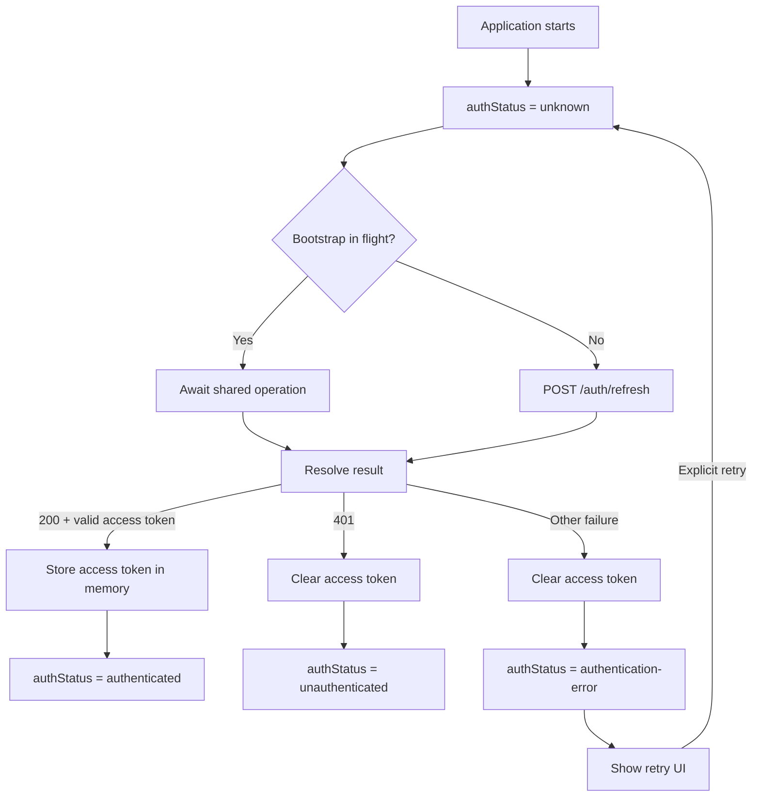
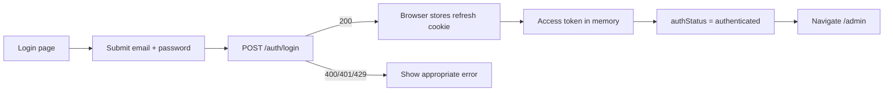
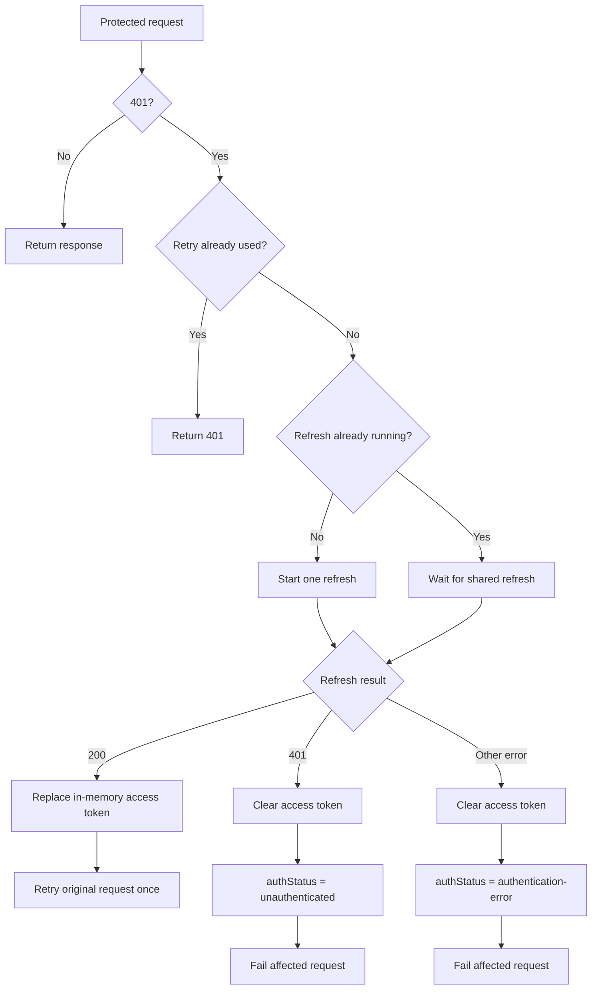
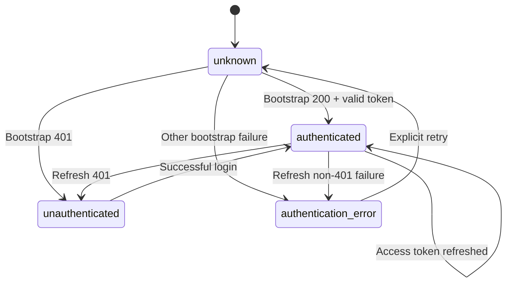

# Frontend Login

## Table of Contents

1. [Scope](#1-scope)
2. [Route Contract](#2-route-contract)
3. [Requirements](#3-requirements)
4. [UI Contract](#4-ui-contract)
5. [Authentication Flow](#5-authentication-flow)
6. [API Contract](#6-api-contract)
7. [Authentication State](#7-authentication-state)
8. [Security Contract](#8-security-contract)
9. [Accessibility](#9-accessibility)
10. [Implementation Criteria](#10-implementation-criteria)

---

# 1. Scope

This document is the frontend source of truth for the Admin Login page and browser authentication behavior.

| ID                  | Item                 | Definition                                                                                                   |
| ------------------- | -------------------- | ------------------------------------------------------------------------------------------------------------ |
| `FE_LOGIN_SCOPE_01` | Frontend Scope       | Admin Login page and frontend authentication behavior                                                        |
| `FE_LOGIN_SCOPE_02` | Auth Source of Truth | Backend Authentication domain                                                                                |
| `FE_LOGIN_SCOPE_03` | Backend Use Case     | `AU_UC_01 — Authenticate Account`                                                                            |
| `FE_LOGIN_SCOPE_04` | Login API            | `POST /auth/login`                                                                                           |
| `FE_LOGIN_SCOPE_05` | Access Token         | In-memory only                                                                                               |
| `FE_LOGIN_SCOPE_06` | Refresh Credential   | Server-managed `HttpOnly` cookie                                                                             |
| `FE_LOGIN_SCOPE_07` | Frontend Ownership   | Frontend owns only in-memory access-token state                                                              |
| `FE_LOGIN_SCOPE_08` | Backend Ownership    | Authentication rules, credentials, tokens, sessions, rotation, replay detection, and authentication security |

The frontend must never read, copy, manually persist, or manually send the refresh credential.

---

# 2. Route Contract

| ID                  | Route    | State                  | Behavior                                                                        |
| ------------------- | -------- | ---------------------- | ------------------------------------------------------------------------------- |
| `FE_LOGIN_ROUTE_01` | `/login` | `unknown`              | Show bootstrap pending state; do not redirect                                   |
| `FE_LOGIN_ROUTE_02` | `/login` | `unauthenticated`      | Show Login page                                                                 |
| `FE_LOGIN_ROUTE_03` | `/login` | `authenticated`        | Redirect to `/admin`                                                            |
| `FE_LOGIN_ROUTE_04` | `/login` | `authentication-error` | Show Login page with retry/error UI                                             |
| `FE_LOGIN_ROUTE_05` | `/admin` | `unknown`              | Show bootstrap pending state; do not redirect                                   |
| `FE_LOGIN_ROUTE_06` | `/admin` | `unauthenticated`      | Redirect to `/login`                                                            |
| `FE_LOGIN_ROUTE_07` | `/admin` | `authenticated`        | Show Admin Shell                                                                |
| `FE_LOGIN_ROUTE_08` | `/admin` | `authentication-error` | Show authentication retry/error UI; do not redirect solely because of the error |

Route protection must wait for authentication bootstrap to resolve.

---

# 3. Requirements

## Authentication

| ID                | Requirement                                                              |
| ----------------- | ------------------------------------------------------------------------ |
| `FE_LOGIN_REQ_01` | Display Admin Login at `/login`.                                         |
| `FE_LOGIN_REQ_02` | Accept email and password.                                               |
| `FE_LOGIN_REQ_03` | Submit credentials to `POST /auth/login`.                                |
| `FE_LOGIN_REQ_04` | Restore authentication after document reload using `POST /auth/refresh`. |
| `FE_LOGIN_REQ_05` | Keep the access token in memory only.                                    |
| `FE_LOGIN_REQ_06` | Keep the refresh credential inaccessible to JavaScript.                  |
| `FE_LOGIN_REQ_07` | Establish authenticated state after successful login or bootstrap.       |
| `FE_LOGIN_REQ_08` | Navigate authenticated users to `/admin`.                                |

## Error Handling

| ID                | Requirement                                                           |
| ----------------- | --------------------------------------------------------------------- |
| `FE_LOGIN_REQ_09` | Show generic invalid-credentials errors.                              |
| `FE_LOGIN_REQ_10` | Show generic `429 AUTHENTICATION_RATE_LIMITED` errors.                |
| `FE_LOGIN_REQ_11` | Treat refresh `401` as unauthenticated.                               |
| `FE_LOGIN_REQ_12` | Do not treat non-`401` bootstrap/refresh failures as unauthenticated. |
| `FE_LOGIN_REQ_13` | Provide a retryable `authentication-error` state.                     |

## Refresh and Retry

| ID                | Requirement                                                                                                    |
| ----------------- | -------------------------------------------------------------------------------------------------------------- |
| `FE_LOGIN_REQ_14` | Allow only one shared in-flight protected-request refresh per browser application context.                     |
| `FE_LOGIN_REQ_15` | Retry each affected protected request at most once.                                                            |
| `FE_LOGIN_REQ_16` | Never recursively refresh the refresh request itself.                                                          |
| `FE_LOGIN_REQ_17` | Never loop indefinitely between `401`, refresh, and retry.                                                     |
| `FE_LOGIN_REQ_18` | Do not automatically retry a failed bootstrap request. Bootstrap retry is user-triggered through the retry UI. |
| `FE_LOGIN_REQ_19` | Do not automatically retry a failed refresh used for protected-request recovery.                               |
| `FE_LOGIN_REQ_20` | Follow the backend-defined cross-context refresh/replay policy.                                                |

## Secret Handling

| ID                | Requirement                                                 |
| ----------------- | ----------------------------------------------------------- |
| `FE_LOGIN_REQ_21` | Never expose authentication tokens in UI.                   |
| `FE_LOGIN_REQ_22` | Never log passwords, access tokens, or refresh credentials. |
| `FE_LOGIN_REQ_23` | Never send authentication tokens in query parameters.       |

---

# 4. UI Contract

## Form

| ID               | Element         | Requirement                                                               |
| ---------------- | --------------- | ------------------------------------------------------------------------- |
| `FE_LOGIN_UI_01` | Email           | `type="email"`, required, `autocomplete="username"`                       |
| `FE_LOGIN_UI_02` | Password        | `type="password"`, required, `autocomplete="current-password"`            |
| `FE_LOGIN_UI_03` | Submit          | Sign In action                                                            |
| `FE_LOGIN_UI_04` | Validation      | Basic required-field validation only                                      |
| `FE_LOGIN_UI_05` | Server Rules    | Authentication rules remain server-side                                   |
| `FE_LOGIN_UI_06` | Password Policy | Frontend must not reject a request using additional password-policy rules |

## UI Error States

| ID               | State                | Behavior                                       |
| ---------------- | -------------------- | ---------------------------------------------- |
| `FE_LOGIN_UI_07` | Invalid Request      | Show request/validation error                  |
| `FE_LOGIN_UI_08` | Invalid Credentials  | Show generic authentication error              |
| `FE_LOGIN_UI_09` | Rate Limited         | Show generic rate-limit error                  |
| `FE_LOGIN_UI_10` | Authentication Error | Show retryable bootstrap/refresh error         |
| `FE_LOGIN_UI_11` | Loading              | Prevent duplicate submission and show progress |

---

# 5. Authentication Flow

## 5.1 Bootstrap

Browser authentication bootstrap resolves the authentication state for the current application load.



### Bootstrap Request Contract

| ID                          | Requirement                                                                      |
| --------------------------- | -------------------------------------------------------------------------------- |
| `FE_LOGIN_BOOTSTRAP_REQ_01` | Method is `POST`.                                                                |
| `FE_LOGIN_BOOTSTRAP_REQ_02` | Endpoint is `/auth/refresh`.                                                     |
| `FE_LOGIN_BOOTSTRAP_REQ_03` | Request body is empty.                                                           |
| `FE_LOGIN_BOOTSTRAP_REQ_04` | Request uses `credentials: "include"`.                                           |
| `FE_LOGIN_BOOTSTRAP_REQ_05` | Request uses `cache: "no-store"`.                                                |
| `FE_LOGIN_BOOTSTRAP_REQ_06` | Authentication is provided by the browser-managed refresh credential.            |
| `FE_LOGIN_BOOTSTRAP_REQ_07` | Frontend code never reads, constructs, stores, or parses the refresh credential. |

### Bootstrap Behavior

| ID                      | Requirement                                                                                              |
| ----------------------- | -------------------------------------------------------------------------------------------------------- |
| `FE_LOGIN_BOOTSTRAP_01` | Initial authentication state is `unknown`.                                                               |
| `FE_LOGIN_BOOTSTRAP_02` | Bootstrap is application-scoped and independent of the current route.                                    |
| `FE_LOGIN_BOOTSTRAP_03` | Only one bootstrap request may be active at a time.                                                      |
| `FE_LOGIN_BOOTSTRAP_04` | Concurrent bootstrap callers reuse the same in-flight operation.                                         |
| `FE_LOGIN_BOOTSTRAP_05` | Component mount/unmount must not create duplicate bootstrap requests.                                    |
| `FE_LOGIN_BOOTSTRAP_06` | `200 OK` with a valid access-token response transitions to `authenticated`.                              |
| `FE_LOGIN_BOOTSTRAP_07` | The access token is stored only in frontend runtime memory.                                              |
| `FE_LOGIN_BOOTSTRAP_08` | `200 OK` with an invalid or incomplete response transitions to `authentication-error`.                   |
| `FE_LOGIN_BOOTSTRAP_09` | `401 Unauthorized` clears the in-memory access token and transitions to `unauthenticated`.               |
| `FE_LOGIN_BOOTSTRAP_10` | Any other bootstrap failure clears the in-memory access token and transitions to `authentication-error`. |
| `FE_LOGIN_BOOTSTRAP_11` | Bootstrap failures are not automatically retried.                                                        |
| `FE_LOGIN_BOOTSTRAP_12` | Bootstrap retry occurs only after an explicit user action.                                               |
| `FE_LOGIN_BOOTSTRAP_13` | `unknown` never redirects to `/login`.                                                                   |
| `FE_LOGIN_BOOTSTRAP_14` | `unknown` never redirects to `/admin`.                                                                   |
| `FE_LOGIN_BOOTSTRAP_15` | `unauthenticated` allows `/login` and redirects protected routes to `/login`.                            |
| `FE_LOGIN_BOOTSTRAP_16` | `authentication-error` renders retryable authentication UI and does not automatically redirect.          |

### React Integration Contract

| ID                            | Requirement                                                                                              |
| ----------------------------- | -------------------------------------------------------------------------------------------------------- |
| `FE_LOGIN_BOOTSTRAP_REACT_01` | Authentication state is exposed through one shared external store.                                       |
| `FE_LOGIN_BOOTSTRAP_REACT_02` | The store provides `subscribe()` and `getSnapshot()`.                                                    |
| `FE_LOGIN_BOOTSTRAP_REACT_03` | The store provides a bootstrap operation shared across consumers.                                        |
| `FE_LOGIN_BOOTSTRAP_REACT_04` | Route components consume the shared authentication state rather than maintaining independent auth state. |
| `FE_LOGIN_BOOTSTRAP_REACT_05` | Re-renders and route changes do not re-run bootstrap after authentication state is resolved.             |

### Required Bootstrap Call

```ts
fetch("/auth/refresh", {
    method: "POST",
    credentials: "include",
    cache: "no-store",
});
```

### Verification Criteria

| ID                             | Verification                                                                                         |
| ------------------------------ | ---------------------------------------------------------------------------------------------------- |
| `FE_LOGIN_BOOTSTRAP_VERIFY_01` | Fresh document load starts in `unknown`.                                                             |
| `FE_LOGIN_BOOTSTRAP_VERIFY_02` | Valid refresh session reaches `authenticated` without requiring `/login`.                            |
| `FE_LOGIN_BOOTSTRAP_VERIFY_03` | Invalid/expired refresh session reaches `unauthenticated` and protected routes redirect to `/login`. |
| `FE_LOGIN_BOOTSTRAP_VERIFY_04` | Non-`401` bootstrap failure reaches `authentication-error` with no automatic retry.                  |
| `FE_LOGIN_BOOTSTRAP_VERIFY_05` | Explicit retry starts a new bootstrap attempt.                                                       |
| `FE_LOGIN_BOOTSTRAP_VERIFY_06` | Concurrent bootstrap callers produce one network request.                                            |

## 5.2 Login



| ID                 | Step                                                            |
| ------------------ | --------------------------------------------------------------- |
| `FE_LOGIN_FLOW_10` | Submit email/password only to `POST /auth/login`.               |
| `FE_LOGIN_FLOW_11` | Use `credentials: "include"` when browser cookies are required. |
| `FE_LOGIN_FLOW_12` | Backend issues the refresh cookie.                              |
| `FE_LOGIN_FLOW_13` | Backend returns access-token data only.                         |
| `FE_LOGIN_FLOW_14` | Store the access token in memory.                               |
| `FE_LOGIN_FLOW_15` | Transition to `authenticated`.                                  |
| `FE_LOGIN_FLOW_16` | Navigate to `/admin`.                                           |

## 5.3 Protected Request Recovery



| ID                 | Rule                                                                                        |
| ------------------ | ------------------------------------------------------------------------------------------- |
| `FE_LOGIN_FLOW_17` | At most one protected-request refresh is active per browser application context.            |
| `FE_LOGIN_FLOW_18` | Concurrent protected-request `401`s wait for the same refresh.                              |
| `FE_LOGIN_FLOW_19` | Retry each original protected request at most once.                                         |
| `FE_LOGIN_FLOW_20` | The refresh request is excluded from refresh-on-`401` handling.                             |
| `FE_LOGIN_FLOW_21` | If the original request has already been retried, return its `401` without another refresh. |
| `FE_LOGIN_FLOW_22` | A failed refresh is not automatically retried.                                              |
| `FE_LOGIN_FLOW_23` | The frontend never retains or manually replays an old refresh credential.                   |

## 5.4 Logout

| ID                 | Rule                                                                               |
| ------------------ | ---------------------------------------------------------------------------------- |
| `FE_LOGIN_FLOW_24` | Logout uses the browser-managed refresh credential.                                |
| `FE_LOGIN_FLOW_25` | Logout does not require an unexpired access token.                                 |
| `FE_LOGIN_FLOW_26` | Successful logout clears the server authentication session.                        |
| `FE_LOGIN_FLOW_27` | Successful logout expires the browser refresh cookie.                              |
| `FE_LOGIN_FLOW_28` | Frontend clears in-memory access-token state and transitions to `unauthenticated`. |

---

# 6. API Contract

## 6.1 Cookie Policy

Cookie attributes depend on the deployment's site relationship.

### Same-Site Cookie Policy

```text
Set-Cookie: __Host-refresh_token=<opaque>; Max-Age=<seconds-until-session-expiry>; Path=/; Secure; HttpOnly; SameSite=Strict
```

### Cross-Site Cookie Policy

```text
Set-Cookie: __Host-refresh_token=<opaque>; Max-Age=<seconds-until-session-expiry>; Path=/; Secure; HttpOnly; SameSite=None
```

For cross-site deployments, `SameSite=None` requires `Secure`.

For cross-origin deployments, credentialed CORS and explicit Origin validation are required according to the backend security contract.

The frontend never constructs or sends a `Cookie` header manually.

The frontend never reads `Set-Cookie`.

## 6.2 Login

| Property     | Contract           |
| ------------ | ------------------ |
| Method       | `POST`             |
| Endpoint     | `/auth/login`      |
| Request      | JSON               |
| Credentials  | `include`          |
| Content-Type | `application/json` |

### Request

```json
{
  "email": "admin@example.com",
  "password": "example-secure-password"
}
```

### Success

```http
HTTP/1.1 200 OK
Content-Type: application/json
Cache-Control: no-store
Set-Cookie: __Host-refresh_token=<opaque>; Max-Age=<seconds-until-session-expiry>; Path=/; Secure; HttpOnly; SameSite=<deployment-policy>
```

```json
{
  "access_token": "opaque-access-token",
  "token_type": "Bearer",
  "expires_in": 3600
}
```

| ID                | Requirement                                                                      |
| ----------------- | -------------------------------------------------------------------------------- |
| `FE_LOGIN_API_01` | Response must not contain `refresh_token`.                                       |
| `FE_LOGIN_API_02` | Frontend must not read `Set-Cookie`.                                             |
| `FE_LOGIN_API_03` | Frontend must not construct a `Cookie` header.                                   |
| `FE_LOGIN_API_04` | Refresh credential expiration must not exceed authentication-session expiration. |

## 6.3 Refresh

| Property    | Contract        |
| ----------- | --------------- |
| Method      | `POST`          |
| Endpoint    | `/auth/refresh` |
| Body        | None            |
| Credentials | `include`       |

```http
POST /auth/refresh
```

The browser attaches the refresh cookie when the deployment's cookie policy permits it.

### Success

```http
HTTP/1.1 200 OK
Content-Type: application/json
Cache-Control: no-store
Set-Cookie: __Host-refresh_token=<new-opaque>; Max-Age=<seconds-until-session-expiry>; Path=/; Secure; HttpOnly; SameSite=<deployment-policy>
```

```json
{
  "access_token": "new-opaque-access-token",
  "token_type": "Bearer",
  "expires_in": 3600
}
```

| ID                | Requirement                                                                                    |
| ----------------- | ---------------------------------------------------------------------------------------------- |
| `FE_LOGIN_API_05` | Server rotates the refresh credential.                                                         |
| `FE_LOGIN_API_06` | Replacement refresh credential does not extend the original authentication-session expiration. |
| `FE_LOGIN_API_07` | Response contains access-token data only.                                                      |
| `FE_LOGIN_API_08` | `401 INVALID_REFRESH_TOKEN` transitions frontend to `unauthenticated`.                         |
| `FE_LOGIN_API_09` | Other refresh failures transition frontend to `authentication-error`.                          |
| `FE_LOGIN_API_10` | A failed refresh is not automatically retried.                                                 |

## 6.4 Logout

| Property    | Contract       |
| ----------- | -------------- |
| Method      | `POST`         |
| Endpoint    | `/auth/logout` |
| Body        | None           |
| Credentials | `include`      |

### Success

```http
HTTP/1.1 204 No Content
Cache-Control: no-store
Set-Cookie: __Host-refresh_token=; Max-Age=0; Path=/; Secure; HttpOnly; SameSite=<deployment-policy>
```

| ID                | Requirement                                                                                               |
| ----------------- | --------------------------------------------------------------------------------------------------------- |
| `FE_LOGIN_API_11` | Logout does not require a bearer access token.                                                            |
| `FE_LOGIN_API_12` | Logout invalidates the authentication session.                                                            |
| `FE_LOGIN_API_13` | Logout is idempotent.                                                                                     |
| `FE_LOGIN_API_14` | Missing or already-invalid refresh credentials may still produce `204` while expiring the browser cookie. |

## 6.5 Error Contract

| ID                | Status | Code                          | Frontend Behavior                 |
| ----------------- | ------ | ----------------------------- | --------------------------------- |
| `FE_LOGIN_ERR_01` | `400`  | `INVALID_REQUEST`             | Show request/validation error     |
| `FE_LOGIN_ERR_02` | `401`  | `INVALID_CREDENTIALS`         | Show generic authentication error |
| `FE_LOGIN_ERR_03` | `401`  | `INVALID_REFRESH_TOKEN`       | Become unauthenticated            |
| `FE_LOGIN_ERR_04` | `429`  | `AUTHENTICATION_RATE_LIMITED` | Show generic rate-limit error     |

---

# 7. Authentication State

## 7.1 Authentication State Model



| ID                  | State                  | Meaning                                                                                                 |
| ------------------- | ---------------------- | ------------------------------------------------------------------------------------------------------- |
| `FE_LOGIN_STATE_01` | `unknown`              | Authentication has not yet been resolved for the current application load.                              |
| `FE_LOGIN_STATE_02` | `authenticated`        | A usable access token is held in frontend memory.                                                       |
| `FE_LOGIN_STATE_03` | `unauthenticated`      | No usable authenticated session is available.                                                           |
| `FE_LOGIN_STATE_04` | `authentication-error` | Authentication could not be resolved because bootstrap or refresh failed for a reason other than `401`. |

## 7.2 State Rules

| ID                       | Requirement                                                                                                                                 |
| ------------------------ | ------------------------------------------------------------------------------------------------------------------------------------------- |
| `FE_LOGIN_STATE_RULE_01` | Initial state is `unknown`.                                                                                                                 |
| `FE_LOGIN_STATE_RULE_02` | `unknown` must not redirect to `/login`.                                                                                                    |
| `FE_LOGIN_STATE_RULE_03` | `unknown` must not redirect to `/admin`.                                                                                                    |
| `FE_LOGIN_STATE_RULE_04` | `authenticated` permits protected-route rendering.                                                                                          |
| `FE_LOGIN_STATE_RULE_05` | `unauthenticated` redirects protected routes to `/login`.                                                                                   |
| `FE_LOGIN_STATE_RULE_06` | `authentication-error` displays retryable authentication UI.                                                                                |
| `FE_LOGIN_STATE_RULE_07` | `authentication-error` must not automatically redirect to `/login`.                                                                         |
| `FE_LOGIN_STATE_RULE_08` | Failed bootstrap/refresh operations clear stale in-memory access-token state before publishing `unauthenticated` or `authentication-error`. |
| `FE_LOGIN_STATE_RULE_09` | Refresh credentials are never represented in authentication state.                                                                          |
| `FE_LOGIN_STATE_RULE_10` | Route components must not maintain independent authentication state.                                                                        |

## 7.3 Store Snapshot

The authentication store exposes only browser-safe state.

```ts
type AuthStatus =
    | "unknown"
    | "authenticated"
    | "unauthenticated"
    | "authentication-error";

type AuthOperation =
    | "bootstrapIdle"
    | "bootstrapPending"
    | "bootstrapRetryPending"
    | "refreshIdle"
    | "refreshing";

interface AuthenticationSnapshot {
    authStatus: AuthStatus;
    operation: AuthOperation;
}
```

| ID                        | Requirement                                                                                                |
| ------------------------- | ---------------------------------------------------------------------------------------------------------- |
| `FE_LOGIN_STATE_STORE_01` | The snapshot contains `authStatus`.                                                                        |
| `FE_LOGIN_STATE_STORE_02` | The snapshot contains the current authentication operation state.                                          |
| `FE_LOGIN_STATE_STORE_03` | The snapshot contains no refresh token or cookie value.                                                    |
| `FE_LOGIN_STATE_STORE_04` | The access token is not exposed through persistent browser storage.                                        |
| `FE_LOGIN_STATE_STORE_05` | The store provides stable `subscribe()` and `getSnapshot()` behavior for React external-store consumption. |

## 7.4 Route Decision Matrix

| Route                 | `unknown`                    | `authenticated`        | `unauthenticated` | `authentication-error`                   |
| --------------------- | ---------------------------- | ---------------------- | ----------------- | ---------------------------------------- |
| `/login`              | Show bootstrap pending state | Redirect `/admin`      | Render Login page | Render Login page with retry/error UI    |
| `/admin`              | Show bootstrap pending state | Render Admin Shell     | Redirect `/login` | Render retryable authentication-error UI |
| Other protected route | Show bootstrap pending state | Render protected route | Redirect `/login` | Render retryable authentication-error UI |

## 7.5 Coordination Rules

| ID                        | Requirement                                                                        |
| ------------------------- | ---------------------------------------------------------------------------------- |
| `FE_LOGIN_STATE_COORD_01` | Only one bootstrap operation may be active at a time.                              |
| `FE_LOGIN_STATE_COORD_02` | Concurrent bootstrap callers share the same in-flight Promise/result.              |
| `FE_LOGIN_STATE_COORD_03` | React remounts must not create independent bootstrap operations.                   |
| `FE_LOGIN_STATE_COORD_04` | Explicit retry may begin only after the previous bootstrap attempt has settled.    |
| `FE_LOGIN_STATE_COORD_05` | Protected-request refresh is separate from initial bootstrap.                      |
| `FE_LOGIN_STATE_COORD_06` | Initial bootstrap must never be triggered by a protected-request `401` retry path. |
| `FE_LOGIN_STATE_COORD_07` | Only one protected-request refresh may be active per browser application context.  |
| `FE_LOGIN_STATE_COORD_08` | Concurrent protected requests waiting for refresh receive the same refresh result. |

---

# 8. Security Contract

## 8.1 Token Storage

| ID                | Rule                                                                                                                      |
| ----------------- | ------------------------------------------------------------------------------------------------------------------------- |
| `FE_LOGIN_SEC_01` | Access token: memory only.                                                                                                |
| `FE_LOGIN_SEC_02` | Refresh credential: browser-managed `HttpOnly` cookie only.                                                               |
| `FE_LOGIN_SEC_03` | Never use `localStorage`, `sessionStorage`, IndexedDB, or other JavaScript-accessible storage for the refresh credential. |
| `FE_LOGIN_SEC_04` | Never send authentication tokens in query parameters.                                                                     |
| `FE_LOGIN_SEC_05` | Never log authentication secrets.                                                                                         |
| `FE_LOGIN_SEC_06` | Never display authentication secrets.                                                                                     |

## 8.2 Cookie Policy

| ID                   | Rule                                                                                                           |
| -------------------- | -------------------------------------------------------------------------------------------------------------- |
| `FE_LOGIN_COOKIE_01` | The refresh cookie uses the `__Host-` prefix, `Secure`, `HttpOnly`, `Path=/`, and no `Domain`.                 |
| `FE_LOGIN_COOKIE_02` | Same-site deployments use `SameSite=Strict` by default.                                                        |
| `FE_LOGIN_COOKIE_03` | Cross-site deployments explicitly using cookie authentication use `SameSite=None; Secure`.                     |
| `FE_LOGIN_COOKIE_04` | `credentials: "include"` does not override browser cookie policy.                                              |
| `FE_LOGIN_COOKIE_05` | Cross-site deployments must account for browser/privacy policies that block cross-site or third-party cookies. |

## 8.3 CSRF, Origin, and CORS

| ID                | Rule                                                                                        |
| ----------------- | ------------------------------------------------------------------------------------------- |
| `FE_LOGIN_SEC_07` | `/auth/login`, `/auth/refresh`, and `/auth/logout` must follow the backend `Origin` policy. |
| `FE_LOGIN_SEC_08` | Cookie-authenticated state-changing endpoints must use the backend CSRF protections.        |
| `FE_LOGIN_SEC_09` | Credentialed cross-origin requests use an explicit allowed-origin list.                     |
| `FE_LOGIN_SEC_10` | Credentialed CORS must not use `Access-Control-Allow-Origin: *`.                            |
| `FE_LOGIN_SEC_11` | Credentialed cross-origin requests require `Access-Control-Allow-Credentials: true`.        |

## 8.4 Refresh Security

| ID                | Rule                                                                                                     |
| ----------------- | -------------------------------------------------------------------------------------------------------- |
| `FE_LOGIN_SEC_12` | Refresh credentials are rotated according to the backend Authentication domain contract.                 |
| `FE_LOGIN_SEC_13` | Rotation must not extend the original authentication-session expiration.                                 |
| `FE_LOGIN_SEC_14` | The frontend never replays an old refresh credential manually.                                           |
| `FE_LOGIN_SEC_15` | Cross-tab/window refresh behavior follows the backend replay/rotation policy.                            |
| `FE_LOGIN_SEC_16` | Protected-request refresh is serialized per browser application context.                                 |
| `FE_LOGIN_SEC_17` | Refresh-on-`401` is bounded to one refresh attempt and one retry per original protected request.         |
| `FE_LOGIN_SEC_18` | Bootstrap automatically executes once; subsequent bootstrap attempts are user-triggered by the retry UI. |
| `FE_LOGIN_SEC_19` | A failed protected-request refresh is not automatically retried.                                         |

---

# 9. Accessibility

| ID                 | Requirement                                                  |
| ------------------ | ------------------------------------------------------------ |
| `FE_LOGIN_A11Y_01` | Each form field has a visible label.                         |
| `FE_LOGIN_A11Y_02` | Validation errors are associated with their relevant fields. |
| `FE_LOGIN_A11Y_03` | Form submission works from the keyboard.                     |
| `FE_LOGIN_A11Y_04` | Focus states are visible.                                    |
| `FE_LOGIN_A11Y_05` | Semantic form controls are used.                             |
| `FE_LOGIN_A11Y_06` | Loading and error states are announced appropriately.        |
| `FE_LOGIN_A11Y_07` | Sign In remains accessible while the form is usable.         |

---

# 10. Implementation Criteria

## Status

| Status         | Meaning                                                          |
| -------------- | ---------------------------------------------------------------- |
| ⚪ Not Started  | Not implemented or not verified                                  |
| 🟡 In Progress | Partially implemented or verification incomplete                 |
| 🟢 Implemented | Implemented and verified                                         |
| 🔴 Blocked     | Cannot proceed because a required dependency/contract is missing |

## 10.1 Routes

| ID                       | Criteria                                                             | Status         | Current Reason                                       |
| ------------------------ | -------------------------------------------------------------------- | -------------- | ---------------------------------------------------- |
| `FE_LOGIN_IMPL_ROUTE_01` | Bootstrap `unknown` state exists                                     | 🔴 Blocked     | Not implemented in `App.tsx`                         |
| `FE_LOGIN_IMPL_ROUTE_02` | `/login` waits for bootstrap                                         | 🔴 Blocked     | Current guard treats missing auth as unauthenticated |
| `FE_LOGIN_IMPL_ROUTE_03` | `/login` redirects authenticated users to `/admin`                   | 🟡 In Progress | Existing volatile-memory guard                       |
| `FE_LOGIN_IMPL_ROUTE_04` | `/admin` waits for bootstrap                                         | 🔴 Blocked     | Current guard redirects before bootstrap             |
| `FE_LOGIN_IMPL_ROUTE_05` | `/admin` redirects unauthenticated users to `/login` after bootstrap | 🟡 In Progress | Existing protection requires bootstrap integration   |
| `FE_LOGIN_IMPL_ROUTE_06` | `/admin` renders Admin Shell when authenticated                      | 🟢 Implemented | Existing route/layout                                |

## 10.2 Authentication Service

| ID                      | Criteria                                                      | Status         | Current Reason                                                |
| ----------------------- | ------------------------------------------------------------- | -------------- | ------------------------------------------------------------- |
| `FE_LOGIN_IMPL_AUTH_01` | Access token is memory-only                                   | 🟢 Implemented | Current auth service uses module memory                       |
| `FE_LOGIN_IMPL_AUTH_02` | Refresh token is removed from frontend state                  | 🔴 Blocked     | Current `AuthenticationSession` still contains `refreshToken` |
| `FE_LOGIN_IMPL_AUTH_03` | Login uses browser credentials                                | 🔴 Blocked     | `credentials: "include"` not implemented                      |
| `FE_LOGIN_IMPL_AUTH_04` | Bootstrap calls `/auth/refresh`                               | 🔴 Blocked     | Not implemented                                               |
| `FE_LOGIN_IMPL_AUTH_05` | Refresh rotates browser credential                            | 🔴 Blocked     | Cookie refresh not implemented                                |
| `FE_LOGIN_IMPL_AUTH_06` | Refresh `401` becomes unauthenticated                         | 🔴 Blocked     | Refresh flow not implemented                                  |
| `FE_LOGIN_IMPL_AUTH_07` | Non-`401` refresh failures become authentication-error        | 🔴 Blocked     | Error state not implemented                                   |
| `FE_LOGIN_IMPL_AUTH_08` | Protected `401` refresh is serialized                         | 🔴 Blocked     | Refresh coordinator not implemented                           |
| `FE_LOGIN_IMPL_AUTH_09` | Protected request retries at most once                        | 🔴 Blocked     | Retry mechanism not implemented                               |
| `FE_LOGIN_IMPL_AUTH_10` | Refresh request is excluded from recursive refresh handling   | 🔴 Blocked     | Refresh interceptor not implemented                           |
| `FE_LOGIN_IMPL_AUTH_11` | Bootstrap does not automatically retry after failure          | 🔴 Blocked     | Retry policy not implemented                                  |
| `FE_LOGIN_IMPL_AUTH_12` | Failed protected-request refresh is not automatically retried | 🔴 Blocked     | Bounded refresh policy not implemented                        |
| `FE_LOGIN_IMPL_AUTH_13` | Refresh credentials are never logged/exposed                  | 🟢 Implemented | No secret rendering/logging found                             |
| `FE_LOGIN_IMPL_AUTH_14` | Logout uses browser-managed refresh credential                | 🔴 Blocked     | Current logout uses bearer access token                       |

## 10.3 Backend Contract Dependencies

| ID                         | Criteria                                                                            | Status     | Current Reason                                                                     |
| -------------------------- | ----------------------------------------------------------------------------------- | ---------- | ---------------------------------------------------------------------------------- |
| `FE_LOGIN_IMPL_BACKEND_01` | Login sets the server-managed refresh cookie with deployment-appropriate attributes | 🔴 Blocked | Backend cookie contract not implemented                                            |
| `FE_LOGIN_IMPL_BACKEND_02` | Refresh accepts browser cookie and returns access token only                        | 🔴 Blocked | Current refresh contract uses request-body refresh token                           |
| `FE_LOGIN_IMPL_BACKEND_03` | Logout authenticates through refresh/session cookie                                 | 🔴 Blocked | Current logout requires bearer access token                                        |
| `FE_LOGIN_IMPL_BACKEND_04` | Refresh expiry cannot exceed session expiry                                         | 🔴 Blocked | Backend currently issues refresh credentials for 30 days against a 24-hour session |
| `FE_LOGIN_IMPL_BACKEND_05` | Origin/CSRF policy is implemented                                                   | 🔴 Blocked | Backend policy requires update                                                     |
| `FE_LOGIN_IMPL_BACKEND_06` | Cross-context refresh/replay policy is implemented                                  | 🔴 Blocked | Backend policy requires update                                                     |

## 10.4 Testing

| ID                 | Test                                                                                        |
| ------------------ | ------------------------------------------------------------------------------------------- |
| `FE_LOGIN_TEST_01` | Successful login transitions authentication state to `authenticated`.                       |
| `FE_LOGIN_TEST_02` | Failed login remains on `/login`.                                                           |
| `FE_LOGIN_TEST_03` | Application startup begins with `authStatus = unknown`.                                     |
| `FE_LOGIN_TEST_04` | Startup invokes `POST /auth/refresh` once for one active application context.               |
| `FE_LOGIN_TEST_05` | Bootstrap uses `credentials: "include"`.                                                    |
| `FE_LOGIN_TEST_06` | Bootstrap sends no refresh-token request body.                                              |
| `FE_LOGIN_TEST_07` | Bootstrap uses `cache: "no-store"`.                                                         |
| `FE_LOGIN_TEST_08` | Valid bootstrap response transitions to `authenticated`.                                    |
| `FE_LOGIN_TEST_09` | Invalid bootstrap response payload transitions to `authentication-error`.                   |
| `FE_LOGIN_TEST_10` | Bootstrap `401` transitions to `unauthenticated`.                                           |
| `FE_LOGIN_TEST_11` | Other bootstrap failures transition to `authentication-error`.                              |
| `FE_LOGIN_TEST_12` | `unknown` does not redirect `/admin` to `/login`.                                           |
| `FE_LOGIN_TEST_13` | `unknown` does not redirect `/login` to `/admin`.                                           |
| `FE_LOGIN_TEST_14` | `authenticated` on `/login` redirects to `/admin`.                                          |
| `FE_LOGIN_TEST_15` | `unauthenticated` on `/admin` redirects to `/login`.                                        |
| `FE_LOGIN_TEST_16` | `authentication-error` does not automatically redirect.                                     |
| `FE_LOGIN_TEST_17` | Bootstrap failure does not automatically retry.                                             |
| `FE_LOGIN_TEST_18` | Explicit retry starts a new bootstrap attempt.                                              |
| `FE_LOGIN_TEST_19` | Concurrent bootstrap callers share one in-flight operation.                                 |
| `FE_LOGIN_TEST_20` | React development Strict Mode does not produce duplicate concurrent bootstrap requests.     |
| `FE_LOGIN_TEST_21` | Component unmount/remount does not invalidate bootstrap.                                    |
| `FE_LOGIN_TEST_22` | Full document reload restores an active authenticated session through `/auth/refresh`.      |
| `FE_LOGIN_TEST_23` | Full document reload reaches `/login` when `/auth/refresh` returns `401`.                   |
| `FE_LOGIN_TEST_24` | Refresh credentials never appear in frontend state, rendered UI, logs, or application APIs. |
| `FE_LOGIN_TEST_25` | Access token exists only in frontend runtime memory.                                        |
| `FE_LOGIN_TEST_26` | Route components use the shared authentication store.                                       |
| `FE_LOGIN_TEST_27` | A protected-request `401` triggers one shared refresh operation.                            |
| `FE_LOGIN_TEST_28` | Concurrent protected-request `401`s share the same refresh operation.                       |
| `FE_LOGIN_TEST_29` | Each original protected request retries at most once.                                       |
| `FE_LOGIN_TEST_30` | Failed protected-request refresh is not automatically retried.                              |
| `FE_LOGIN_TEST_31` | The refresh endpoint cannot recursively trigger another refresh operation.                  |
| `FE_LOGIN_TEST_32` | Logout clears server-side authentication and in-memory access state.                        |
| `FE_LOGIN_TEST_33` | Refresh credentials never appear in the authentication store snapshot.                      |
| `FE_LOGIN_TEST_34` | Cross-context authentication behavior follows the backend authentication contract.          |

### Test Coverage Matrix

| Area                       | Required IDs            |
| -------------------------- | ----------------------- |
| Login                      | `FE_LOGIN_TEST_01`–`02` |
| Bootstrap                  | `FE_LOGIN_TEST_03`–`11` |
| Routing                    | `FE_LOGIN_TEST_12`–`16` |
| Retry/coordination         | `FE_LOGIN_TEST_17`–`21` |
| Reload/session restoration | `FE_LOGIN_TEST_22`–`25` |
| Store integration          | `FE_LOGIN_TEST_26`      |
| Protected-request recovery | `FE_LOGIN_TEST_27`–`31` |
| Logout                     | `FE_LOGIN_TEST_32`      |
| Credential isolation       | `FE_LOGIN_TEST_33`      |
| Cross-context behavior     | `FE_LOGIN_TEST_34`      |

## 10.5 Current Verification Status

| Area                            | Status         |
| ------------------------------- | -------------- |
| Login form UI                   | 🟢 Implemented |
| Basic validation                | 🟢 Implemented |
| In-memory access token          | 🟢 Implemented |
| Reload-safe authentication      | 🔴 Blocked     |
| HttpOnly refresh cookie         | 🔴 Blocked     |
| Bootstrap refresh               | 🔴 Blocked     |
| Protected-request refresh/retry | 🔴 Blocked     |
| Cookie-based logout             | 🔴 Blocked     |
| Origin/CSRF/CORS policy         | 🔴 Blocked     |
| Cross-context refresh policy    | 🔴 Blocked     |
